# 요미 달력 · Yomi Calendar {#요미-달력--yomi-calendar}

> *A tiny calendar to capture your today — memos, money, todos, scores, and moods, all in one tap.*

<strong><a href="#요미-달력--yomi-calendar">한국어</a> · <a href="#english">English</a></strong>

**일정, 소비, 할 일, 숫자 기록, 기분 캐릭터를 한 날짜에 모아 기록하는 귀여운 생활 달력**입니다.

무엇보다 **광고가 없습니다!** 하루의 기분을 **귀여운 캐릭터**로 표현할 수 있습니다. 일정을 가족에게 공유하고 싶을 때, 더 많은 캐릭터를 사용하고 싶을 때는 **도시락** 계정을 만들어 사용하셔야 해요! 계정을 만드시면 매일 출석 체크하여 **1 Yomi Coin**씩 모을 수 있어요. 처음 가입하면 **29 Yomi Coin**을 드립니다.

| | |
|---|---|
| **현재 버전** | F.1.12 |
| **스토어 표기** | 요미 달력 · Yomi Calendar (기기·언어에 따라 다를 수 있음) |

<strong>목차</strong> · <a href="#장점-한-눈에">장점</a> · <a href="#기능-둘러보기">기능</a> · <a href="#편의-기능">편의</a> · <a href="#데이터-저장">데이터</a> · <a href="#faq">FAQ</a> · <a href="#english">English</a>

  

### 소개 영상

30초짜리 앱 소개 영상은 YouTube에서 볼 수 있습니다.

▶ **[요미 달력 소개 영상 보기](https://youtu.be/QZBNNUx_LD0)**

---

## 장점 한 눈에 {#장점-한-눈에}

| 장점 | 한 줄 설명 |
|------|-----------|
| **광고 없음** | 기록하는 순간을 배너·전면 광고가 끼어들지 않습니다 |
| **가입 없이 시작** | 이름·전화번호 없이 바로 쓸 수 있습니다. 서버 기능도 이메일 중심 |
| **하루를 한곳에** | 오늘은 · 썼니 · 했니 · 기록 · 기분을 날짜 하나에 |
| **귀여운 GUI** | 캐릭터 기분, 파스텔 테마, 친근한 메뉴명(오늘은/썼니/했니/도시락) |
| **돌아보고 싶어지는 기록** | 월별 차트, 기분 배지, 달력 하단 마커 줄 |
| **도시락 보상·공유** | 출석 +1 Coin, 가족·지인과 오늘은/했니만 부드럽게 공유 |
| **내 데이터 소유** | ZIP 백업·복원, 선택적 앱 잠금, 로컬 우선 저장 |

---

## 기능 둘러보기 {#기능-둘러보기}

### 1. 광고 없이, 필요한 만큼만 — 조용한 개인 달력

- **광고 없음** — 메모·가계부·체크 입력 중 배너가 끼어들지 않습니다
- **기본 무료** — 달력·4종 기록·기분·차트·백업은 계정 없이 사용
- **최소 정보** — 이름·생년월일·전화번호를 요구하지 않습니다
- **로컬 우선** — 일기·가계부·기분 본문은 **휴대폰 안에만** 저장

  

### 2. 하루를 한 날짜에 — 오늘은 · 썼니 · 했니 · 기록

| 메뉴 | 하는 일 | 달력 표시 |
|------|---------|-----------|
| **오늘은** | 항목당 최대 10자 짧은 메모 | 하단 **1번째** · 핑크 하트 |
| **썼니** | 수입·지출 한 줄씩 | 하단 **2번째** · 파란 **$** |
| **했니** | 할 일·습관 체크 | 하단 **3번째** · 초록 체크 |
| **기록** | 체중·공부·운동 등 숫자 | 하단 **4번째** · 보라 꺾은선 |

**F.1.12:** 기록 이름 **선택 팝업** · 자주 쓰는 이름 **뱅크**(저장·수정·삭제).

  
  &nbsp;
  

  
  &nbsp;
  

**달력 칸 한눈에** — 날짜 **아래 한 줄**에 **오늘은 → 썼니 → 했니 → 기록** 순서로 아이콘이 붙습니다(기록이 있는 항목만). 가운데는 **기분 캐릭터**. 설정 **「달력에 오늘은 일정 표시」** ON 시 오늘은 **최대 3줄** 미리 보기.

  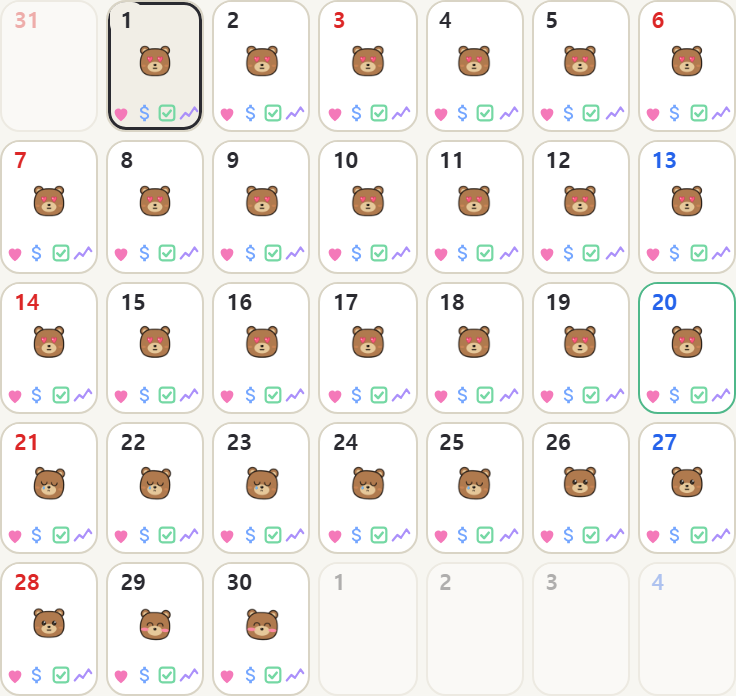

  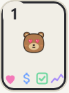
  &nbsp;
  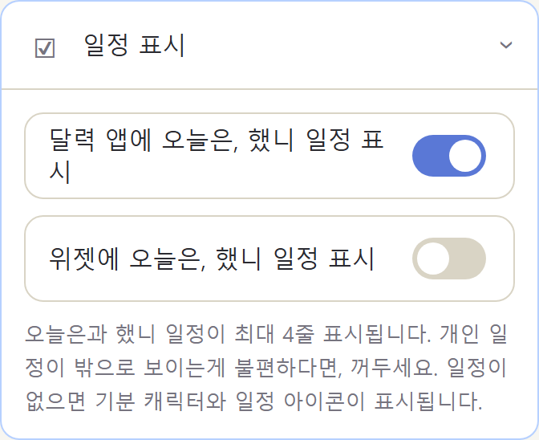
  &nbsp;
  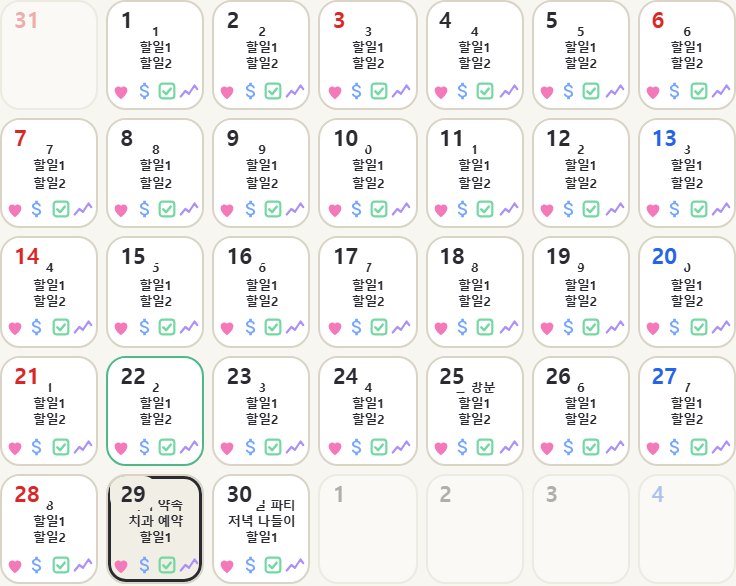

### 3. 귀여운 캐릭터로 — 기분까지

  
  &nbsp;
  

**이 달의 기분 배지** — 1위(왼쪽·크게) · 2위(오른쪽·작게). 동률이면 **최근 기록**이 1위. 달력 상단 배지는 앱과 같이 **GIF**로 움직입니다.

  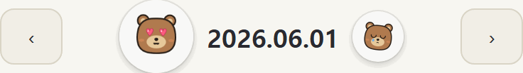

### 4. 한 달이 모이면 — 기록 차트

기분 podium · 썼니/했니 막대+누적 · 기록 꺾은선. **F.1.11:** 파스텔 아코디언 헤더 · **한 섹션만 펼침**(탭하면 나머지 자동 접힘).

  
  &nbsp;
  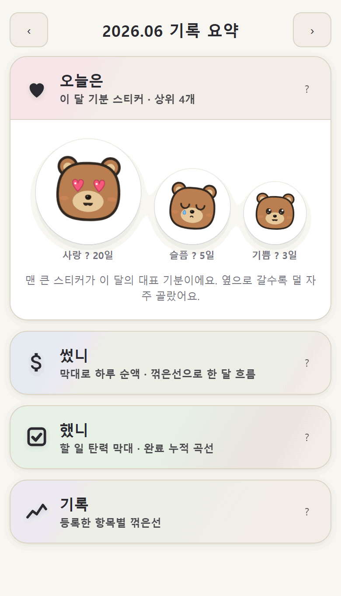

### 5. 도시락 — 출석 · 코인 · 가족 공유

| 항목 | Yomi Coin |
|------|-----------|
| 가입 보너스 | **+29** (계정당 1회) |
| 출석 | **+1** / 일 |
| 일정 공유 | **−1** / 건 (송·수신 각자) |
| 캐릭터 팩 | **−30** / 셋 |

  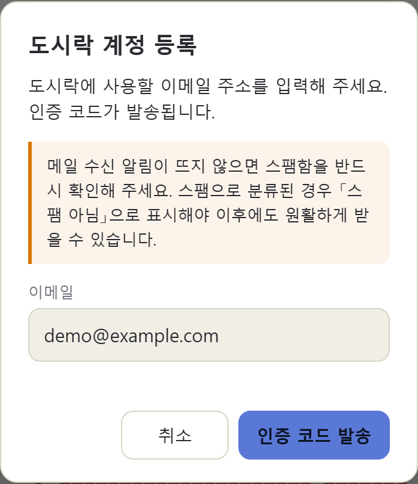
  &nbsp;
  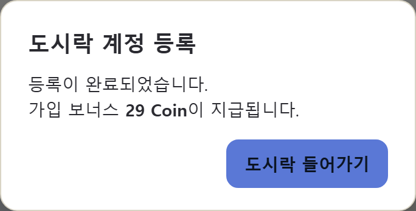

  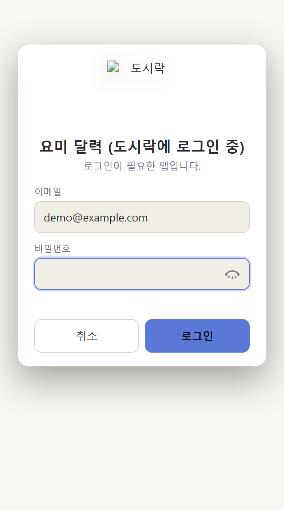
  &nbsp;
  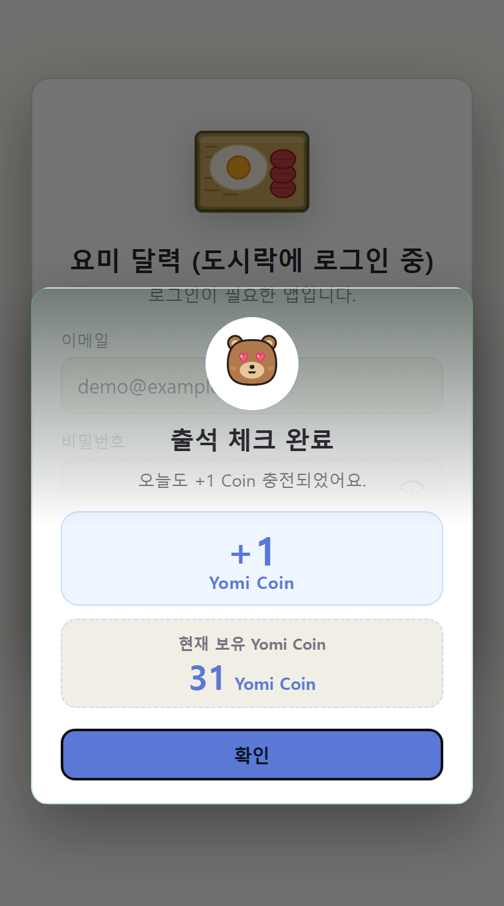

**일정 공유** — **오늘은·했니**만. 썼니·기록·기분은 포함 안 됨.

  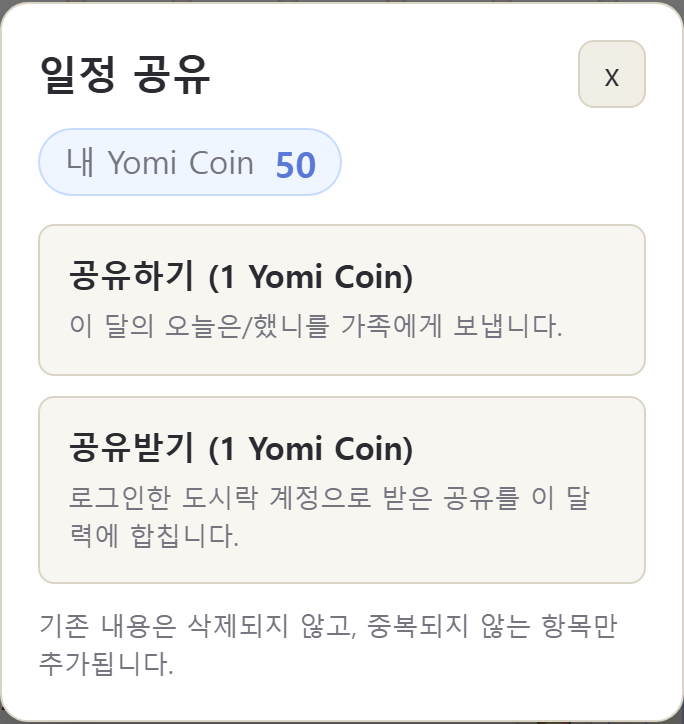
  &nbsp;
  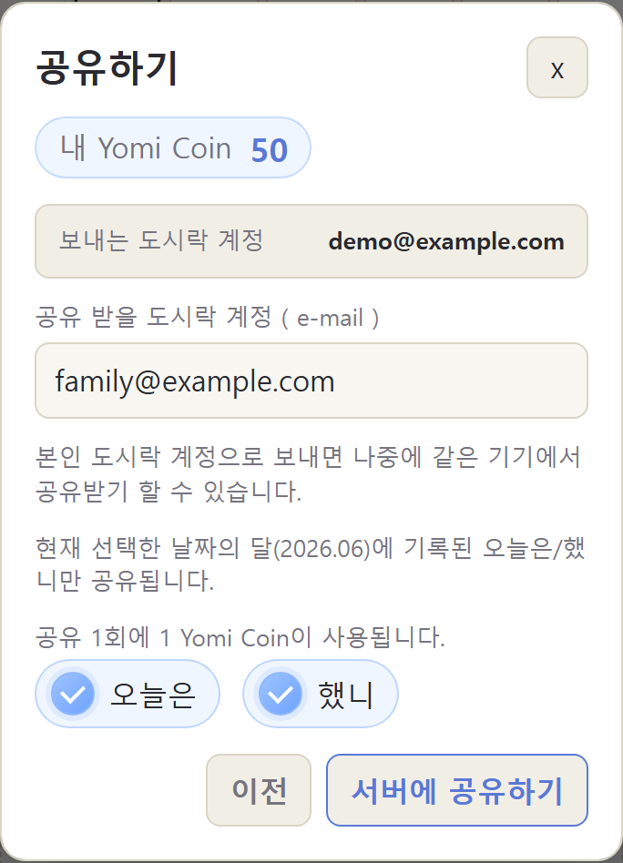

  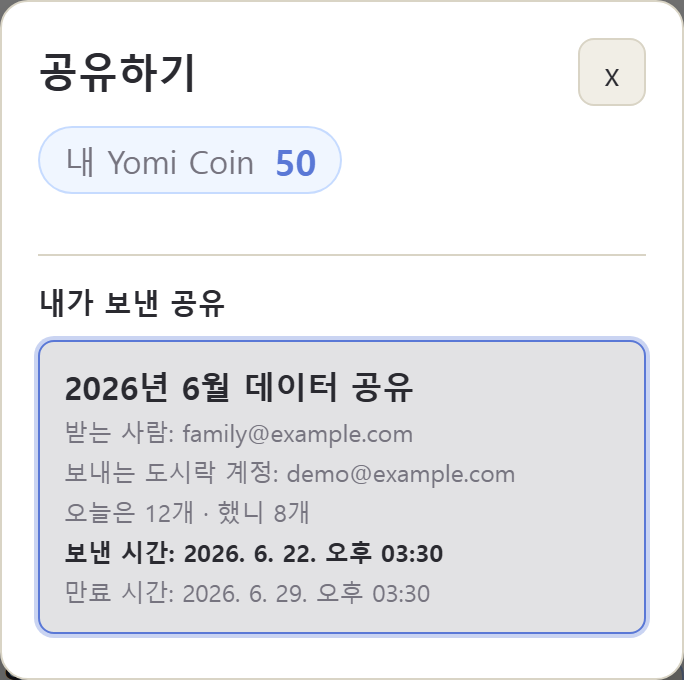
  &nbsp;
  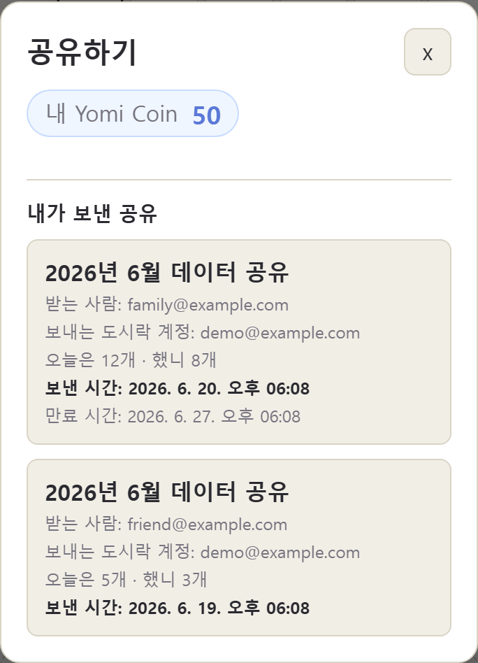

### 6. 내 기록은 내 것 — 백업 · 선택 잠금

| 로그인 | 목적 | 세션 |
|--------|------|------|
| **앱 로그인** | 앱 실행 잠금 | 앱 완전 종료 시 세션 만료 |
| **도시락 접근시** | 도시락 탭 보호 | **3분** 무활동 만료 |

  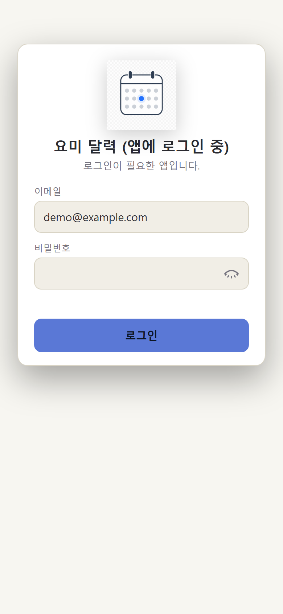
  &nbsp;
  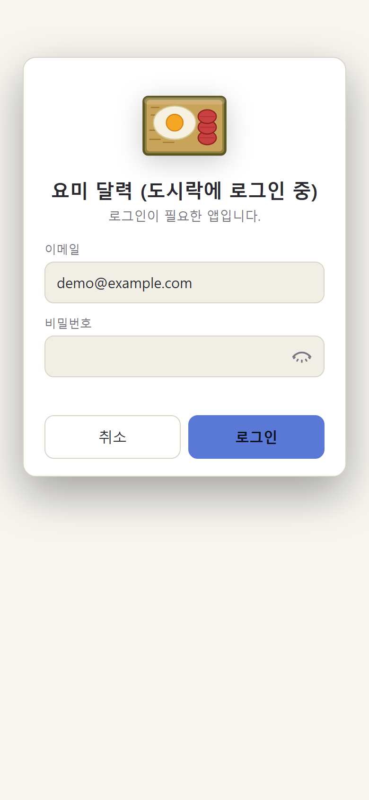

---

## 편의 기능 {#편의-기능}

**알림 (F.1.11)** — 오늘은 · 썼니 · 했니 **각각** 시간 설정. 항목 있는 날만 발송.

  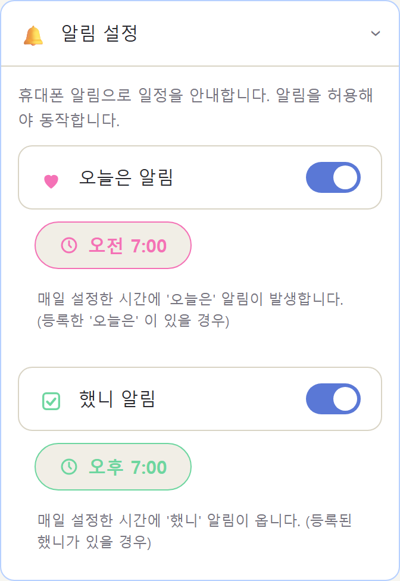

**위젯 (F.1.12)** — **기분 위젯**(1×1) · **달력 위젯**(4×5, 이번 달 미니 달력·마커·오늘은 미리보기). 설정의 위젯 일정 표시와 연동.

**Yomi Progress (F.1.12)** — 인증·도시락·공유·출석 등 서버 처리 중 캐릭터 GIF로 진행 상태 표시. 한국어는 캐릭터 이름 **이/가** 조사 자동.

**가로 · 테마 · 10개 언어** — 파스텔 8색, ko/en/zh/ja/tl/vi/ru/es/de/fr, 언어별 공휴일.

  

  
  &nbsp;
  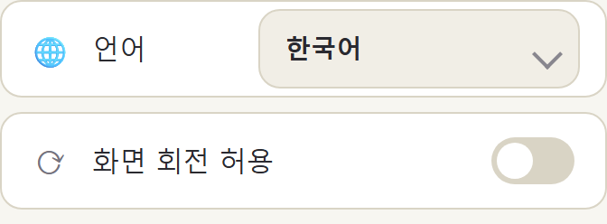

> 스크린샷은 **paper** 테마 기준.

---

## 데이터는 어디에? {#데이터-저장}

- 기록 본문 → **휴대폰만** · 공유 시 **오늘은·했니**만 서버 경유
- **내보내기/불러오기** ZIP으로 기기 간 이동

---

## FAQ {#faq}

**Q. 도시락과 일정 공유는 무엇인가요?**  
**도시락**은 Yomi Coin·출석·캐릭터 팩·공유를 관리하는 공간입니다. **일정 공유**는 선택한 달의 **오늘은·했니**만 **공유받을 상대의 이메일 계정 정보와 함께 서버로 전송**됩니다(이메일 발송이 아닙니다). 상대방은 앱 **공유받기** 기능으로 받을 수 있습니다. **가계부·기분**은 포함되지 않습니다.

**Q. 도시락 서버와 연결을 끊으면 Coin이 사라지나요?**  
아닙니다. Yomi Coin과 구매한 팩은 보존됩니다.

**Q. 앱 로그인과 도시락 접근시 로그인은 같은 건가요?**  
아닙니다. 앱 로그인은 **앱 시작 잠금**, 도시락 접근시 로그인은 **도시락 탭 보호**(3분 무활동 만료)입니다.

**Q. 인터넷 없이 쓸 수 있나요?**  
네. 메모·가계부·체크·기록·기분·위젯·백업은 오프라인 가능. 공유·도시락은 인터넷 필요.

**Q. iOS 버전은?**  
안드로이드 정식 출시 이후 준비 들어갑니다. 상세 일정 문의: **yourboardlab@gmail.com**

---
## English {#english}

# Yomi Calendar · 요미 달력

> *A tiny calendar to capture your today — memos, money, todos, scores, and moods, all in one tap.*

<strong><a href="#요미-달력--yomi-calendar">한국어</a> · <a href="#english">English</a></strong>

**Version F.1.12** — A cute **life calendar**, not a work calendar. Log schedule, spending, todos, numbers, and mood **on one date**. **No ads.** **No account required** by default. Optional **Bento (도시락)** for Yomi Coin, sharing, and character packs.

### Highlights

| | |
|---|---|
| **No ads** | Quiet recording without banners |
| **One date, everything** | Today · Spent? · Done? · Stats · Mood |
| **Cute GUI** | Character moods, pastel themes, friendly names |
| **Monthly charts** | Patterns at a glance (F.1.11: exclusive accordion) |
| **Bento** | Check-in +1 Coin/day, family sharing (Today + Done? only) |
| **Your data** | On-device storage, ZIP export/import, optional app lock |

  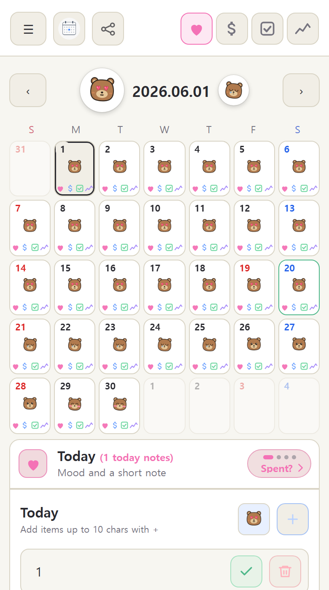

### Four record types

  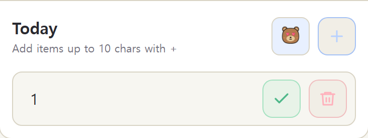
  &nbsp;
  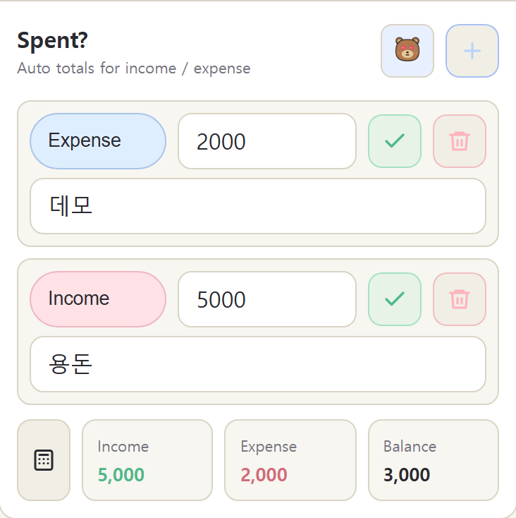
  &nbsp;
  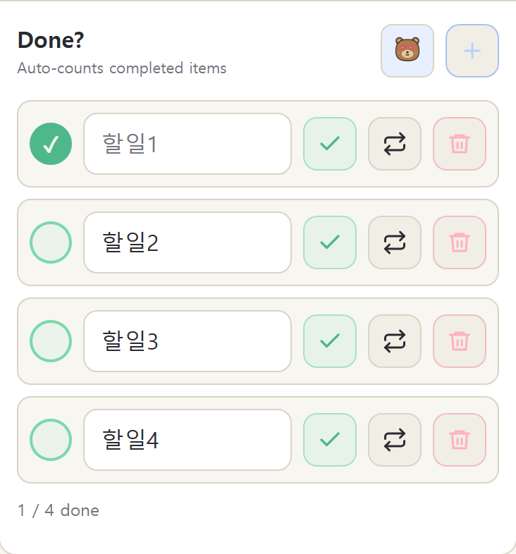
  &nbsp;
  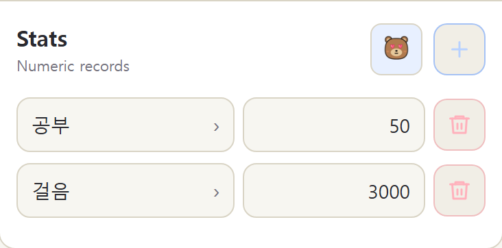

### Mood · Charts · Bento · Share

  
  &nbsp;
  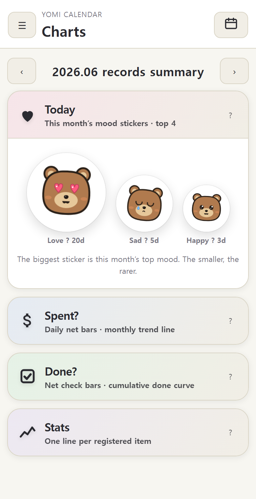

  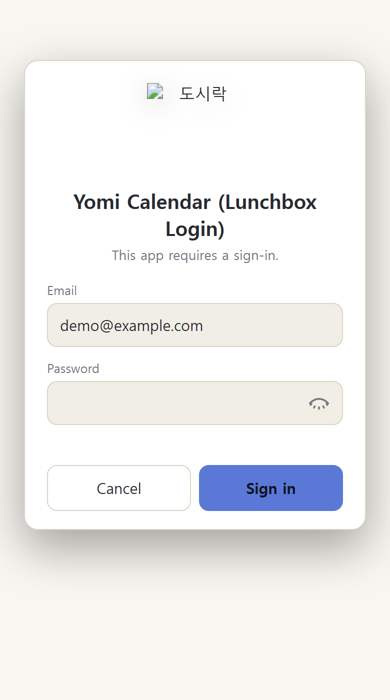
  &nbsp;
  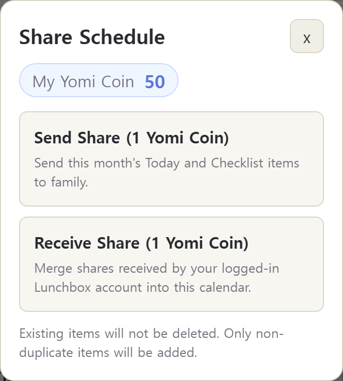

### Extras (F.1.12)

- **Calendar widget (4×5)** + Mood widget (1×1) on Android home screen
- **Yomi Progress** — character GIF status during server operations; Korean **이/가** auto by name
- **Stats name picker** — persistent name bank (save / edit / delete)
- **Notifications (F.1.11)** — separate times for Today / Spent? / Done?; only on days with entries
- **Two logins** — App lock vs Bento tab access (3-min idle expiry)
- **10 languages** + public holidays by language

  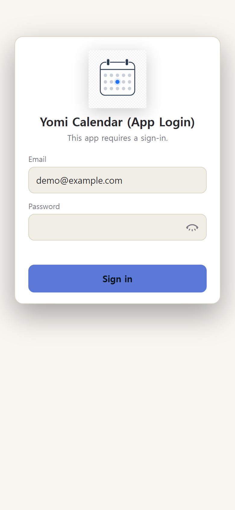
  &nbsp;
  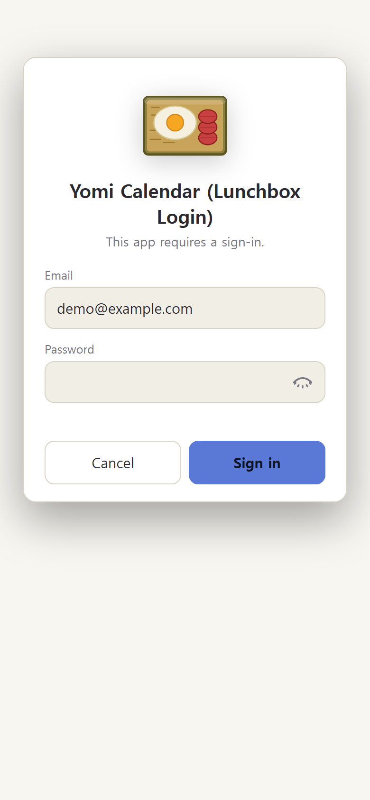

  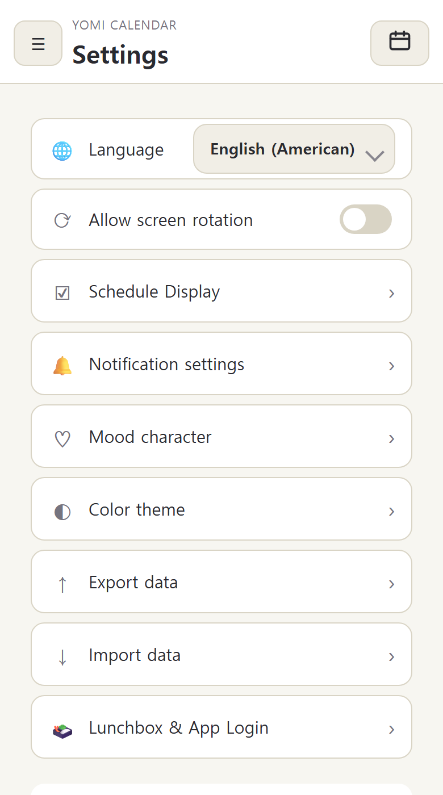
  &nbsp;
  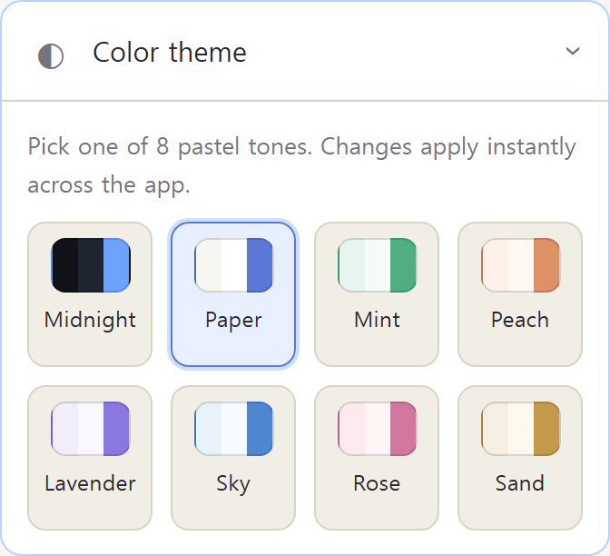

### FAQ (English)

**Q. Bento & sharing?** Yomi Coin account for check-in, packs, and sharing **Today + Done?** only — never ledger or mood bodies.  
**Q. Offline?** Core features yes; sharing needs internet.  
**Q. iOS?** Development begins after the Android official release. Schedule inquiries: **yourboardlab@gmail.com**

---
## 개인정보처리방침 · Privacy Policy

> **Google Play 등 스토어 등록용 공개 URL**  
> `https://github.com/yourboardlab/calendar_readme#개인정보처리방침--privacy-policy`  
> **최종 업데이트:** 2026-06-22 · **앱:** 요미 달력 (Yomi Calendar) · **버전:** F.1.12 · **운영:** yourboardlab

### 한국어

**1. 개요**  
yourboardlab(이하 "개발자")이 제공하는 **요미 달력**(Yomi Calendar)은 사용자가 직접 입력한 일기·메모·가계부·체크·기록·기분 데이터를 **사용자 기기 안에만** 저장하는 앱입니다. **앱 로그인**과 **도시락 접근시 로그인**은 선택이며, 각각 독립 세션으로 동작합니다. **도시락** 기능으로 Yomi Coin 계정을 만들어 일정 공유 및 이모티콘 구매를 할 수 있으며, 공유 기능 사용 시에만 선택한 **오늘은·했니** 항목이 서버를 경유합니다. 클라우드 동기화·광고 식별자 추적은 하지 않습니다.

**2. 수집·처리하는 정보**

| 구분 | 내용 | 저장 위치 |
|------|------|-----------|
| 사용자 입력 | 메모(오늘은), 가계부(썼니), 체크(했니), 숫자 기록, 기분, 설정(테마·언어·회전 등) | 기기 내부 저장소만 |
| 일정 공유·도시락(선택) | 사용자가 직접 선택해 공유한 **오늘은·했니 항목** | 공유 서버 (수신자 확인 후 처리) |
| 도시락 계정(선택) | 이메일, 비밀번호 **해시**, Yomi Coin 잔액, 이모티콘 구매 이력 | 기기 및 도시락 서버 |
| 로그인(선택) | 이메일, 비밀번호 **해시**, 마지막 로그인 이메일 | 기기 내부 저장소만 |
| 인증 메일 | 로그인·도시락 가입·재설정 시 **이메일 주소·인증 코드·서명** | 인증 서버 → SMTP (본문은 사용자 메일함만) |
| 백업 파일 | 설정에서 **데이터보내기** 시 사용자가 만든 ZIP | 사용자가 선택한 위치(파일 앱 등) |
| 공휴일 조회 | 설정 언어에 대응하는 **국가 코드**와 **연도** | 공휴일 API 요청 시에만 전송 |
| 위젯 표시 | 오늘 날짜·기분·오늘은·체크 요약 등 앱과 동기화한 최소 정보 | 기기 내부(Android 위젯용 설정) |

개발자는 이름, 이메일(도시락/로그인 제외), 전화번호, 위치, 연락처, 사진 등을 앱 안에서 수집하지 않습니다.

**3. 제3자 서비스**  
- **일정 공유·도시락 서버:** 사용자가 선택한 일정 항목을 전달하기 위해 인증 서버를 사용합니다. 현재 무료 백엔드로 운영 중이며, 이용이 늘어나면 유료 전환이 필요할 수 있습니다. 일기·가계부·체크·기분 본문은 전송하지 않으며, 공유 기능을 사용하지 않을 경우 서버 통신은 발생하지 않습니다.
- **공휴일 API:** [Nager.Date](https://date.nager.at) 공개 API를 사용합니다. **연도·국가 코드** 수준의 요청만 이루어집니다. 사용자가 작성한 메모 본문 등은 전송하지 않습니다.
- 응답은 기기에 **캐시**되어, 이후 같은 연·월을 볼 때 네트워크 없이도 표시될 수 있습니다.

**4. 이용 목적**  
앱 기능 제공(달력 표시, 기록·차트, 홈 화면 위젯, 알람 알림 등), 사용자 설정 반영(언어, 테마, 기분 캐릭터 등), 사용자가 요청한 보내기·불러오기.

**5. 보관 기간**  
앱 데이터는 사용자가 삭제·앱 제거·데이터 초기화할 때까지 기기에 보관됩니다. 공휴일 캐시는 기기 내부에 일정 기간 보관 후 갱신될 수 있습니다.

**6. 제3자 제공·판매**  
개발자는 사용자 데이터를 **판매하거나**, 광고 목적으로 **제3자와 공유하지 않습니다.**

**7. 권한 (Android)**

| 권한 | 용도 |
|------|------|
| 인터넷 | 공휴일 API 조회, 일정 공유, 인증 메일 발송 |
| 부팅 완료 수신 | 홈 화면 위젯 날짜 갱신 |
| 정확한 알람 | 사용자가 설정한 **알람** 알림 예약 |

**8. 아동**  
앱은 만 13세 미만을 대상으로 설계되지 않았으며, 개발자는 아동의 개인정보를 고의로 수집하지 않습니다.

**9. 국제 이전**  
사용자 입력 데이터는 사용자 기기에만 남습니다. 공휴일 API·공유 서버는 해외에 서버가 있을 수 있습니다.

**10. 이용자 권리**  
- 앱 **설정 → 보내기**로 데이터를 ZIP으로 받을 수 있습니다.
- **불러오기**·앱 삭제·기기 초기화로 데이터를 지울 수 있습니다.
- 문의: **yourboardlab@gmail.com**

**11. 정책 변경**  
중요한 변경 시 이 README를 갱신하고, 필요한 경우 앱 또는 스토어를 통해 안내할 수 있습니다.

---

### English

**1. Overview**  
**Yomi Calendar** (요미 달력), operated by **yourboardlab**, stores your entries **on your device only**. **App sign-in** and **Bento access sign-in** are optional and use **independent sessions** (Bento access expires after 3 minutes idle). Use **Bento** for Yomi Coin, sharing, and emoticon packs; only selected **Today + Done?** items pass through our server when you share. No cloud sync or ad tracking.

**2. Information we process**

| Type | Examples | Where it stays |
|------|----------|----------------|
| Your entries | Memos, expenses, checklists, scores, moods, app settings | On-device storage only |
| Schedule sharing / Bento (optional) | **Today + Done?** items you select and share | Sharing server (processed on delivery) |
| Bento account (optional) | Email, password **hash**, Yomi Coin balance, emoticon purchase history | Device + Bento server |
| Sign-in (optional) | Email, **encrypted password hash**, last sign-in email | On-device storage only |
| Verification email | Email address, verification code, signature when setting up or resetting | Authentication server → SMTP (to your mailbox only) |
| Backup ZIP | ZIP created when you tap **Export** in Settings | Where you save the file |
| Public holidays | **Country code** and **year** derived from your language setting | Sent only when calling the holiday API |
| Home widget | Today's date, mood, short memo/checklist summaries synced from the app | On-device (Android widget preferences) |

We do **not** collect your name, phone number, contacts, photos, or precise location inside the app. Email is only processed when you optionally enable sign-in or Bento.

**3. Third-party services**  
- **Schedule sharing / Bento server:** When you choose to share, selected Today + Done? items are delivered via our authentication server. Currently operated on a free-tier backend; a move to a paid backend may be needed if usage grows. Diary, ledger, and mood bodies are never included. If you don't use sharing features, no server communication occurs.
- **Holiday API:** We use the public [Nager.Date](https://date.nager.at) API. Requests include **year and country code** only — not the text of your entries.
- Responses may be **cached on your device** for offline reuse.

**4. Purposes**  
Provide app features (calendar, charts, home-screen widget, alarm notifications), apply your preferences (language, theme, mood character, etc.), and support import/export when you choose.

**5. Retention**  
App data remains on your device until you delete it, clear app data, or uninstall. Holiday cache may expire and refresh over time.

**6. Sharing / sale**  
We **do not sell** your data or share it with third parties for advertising.

**7. Android permissions**

| Permission | Purpose |
|------------|---------|
| Internet | Public holidays, schedule sharing, verification emails |
| Receive boot completed | Refresh the home-screen widget date |
| Schedule exact alarms | Deliver **alarms** you set in the app |

**8. Children**  
The app is not directed at children under 13, and we do not knowingly collect their personal information.

**9. International transfers**  
Your entries stay on your device. Holiday API and sharing server requests may reach servers operated outside your country.

**10. Your choices**  
- **Export** your data as a ZIP from Settings.
- **Import**, uninstall, or reset the app to remove data.
- Contact: **yourboardlab@gmail.com**

**11. Changes**  
We may update this policy by revising this README and, when appropriate, notifying users via the app or store listing.

---

## 코인 충전 (준비 중)

현재 Yomi Coin은 **출석 체크**(하루 +1코인)와 **가입 보너스**(+29코인)로 무료 적립되며, 이 코인으로 일정 공유(1코인/건)나 이모티콘 셋(30코인/셋)을 이용할 수 있습니다. 향후 현금으로 코인을 충전하는 기능이 추가될 예정입니다.

> 광고 없이 앱을 지속적으로 개선하기 위한 방향으로, 무료 핵심 기능(달력·메모·가계부·체크·기분)은 계속 무료로 유지됩니다.

## Coin Recharge (coming soon)

Yomi Coins are currently earned free via **daily check-in** (+1/day) and **sign-up bonus** (+29 once). Use coins for schedule sharing (1 coin each) or emoticon sets (30 coins each). A paid top-up option will be added in a future update.

> Core features (calendar, memos, ledger, checklists, mood) remain free. Coins support continued development without ads.

---

## 지원 / 문의

- 사용 중 문제, 새로운 기분 캐릭터 / 테마 제안, 혹은 단순한 후기 — 모두 환영합니다.
- 이슈 등록: [Issues 탭](https://github.com/yourboardlab/calendar_readme/issues/new) 에 자유롭게 글을 남겨 주세요.
- 비지니스 및 문의 사항: **yourboardlab@gmail.com**
- 홈페이지: [yourboardlab.github.io](https://yourboardlab.github.io/)
- 소개 영상: [YouTube — 요미 달력 소개](https://youtu.be/QZBNNUx_LD0)
- 개인정보처리방침: [이 README의 개인정보처리방침 섹션](https://github.com/yourboardlab/calendar_readme#개인정보처리방침--privacy-policy)

---

## 변경 이력

| 버전 | 날짜 | 요약 |
|------|------|------|
| **F.1.12** | 2026-06-22 | 달력 위젯(4×5), Yomi Progress, 기록 이름 뱅크, 한국어 조사 자동, 브랜드 메일 |
| **F.1.11** | 2026-06-18 | 탭별 알림, 앱/도시락 로그인 세션 분리, 차트 배타적 아코디언, 기분 위젯, 연결 끊기 UX |
| **F.1.10** | 2026-06-12 | 도시락·일정 공유, Yomi Coin, 기분 캐릭터 팩 |
| **F.1.08** | 2026-05-29 | 달력에 오늘은 일정 표시(설정), 썼니 $ 아이콘 |
| F.1.07 | 2026-05-27 | 선택 로그인, ZIP v4, 월 기분 배지 |
| F.1.04 | 2026-05-19 | 공휴일 API, 홈 위젯, 가로 모드 |

---

## 라이선스 / 저작권

- 앱 자체의 코드 라이선스는 별도 비공개 저장소에서 관리됩니다.
- 이 저장소(`calendar_readme`)의 텍스트와 스크린샷은 © 2026 yourboardlab. All rights reserved.
- 사용된 캐릭터 자산은 yourboardlab 의 PNG/GIF 입니다.

---

  <em>오늘을 가볍게 남기는 습관이, 어느 날 가장 따뜻한 기록이 됩니다.</em>

