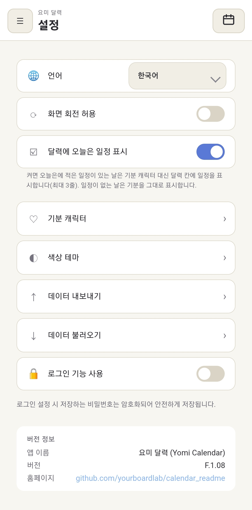
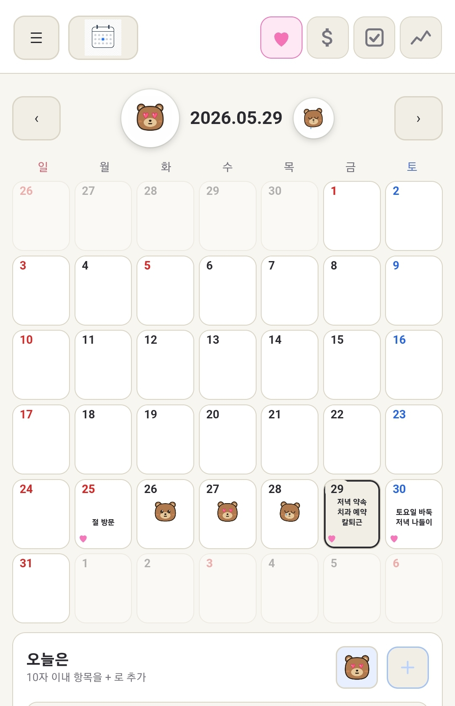
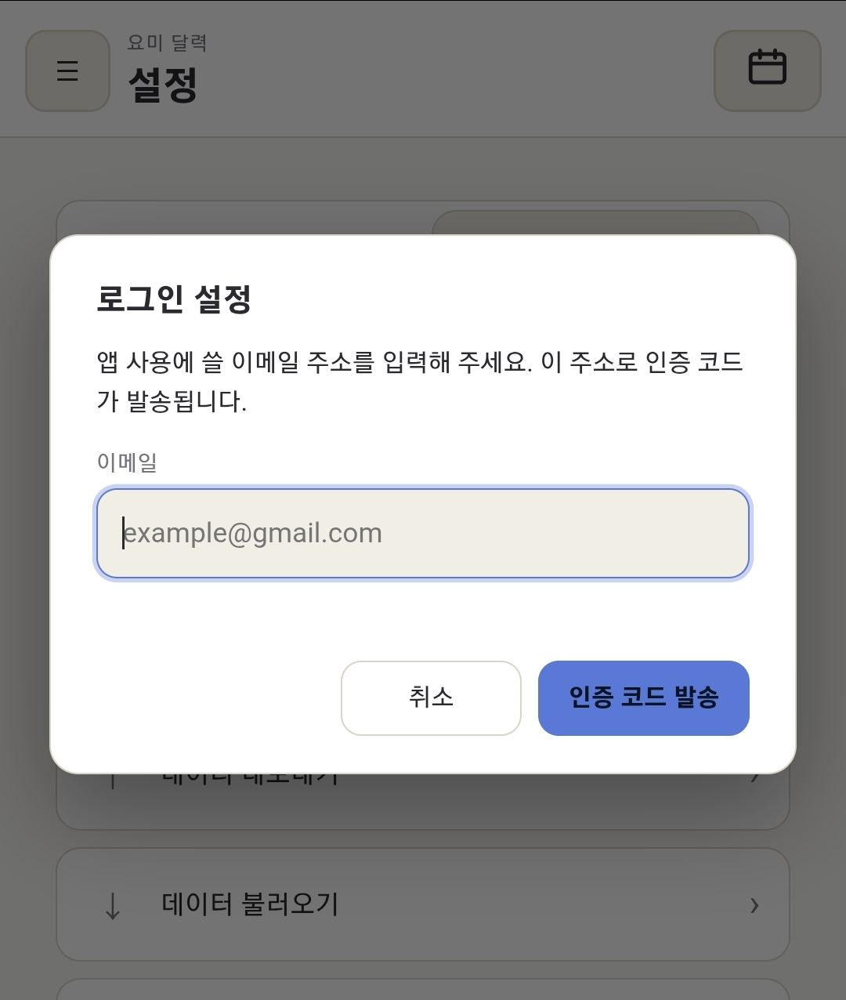
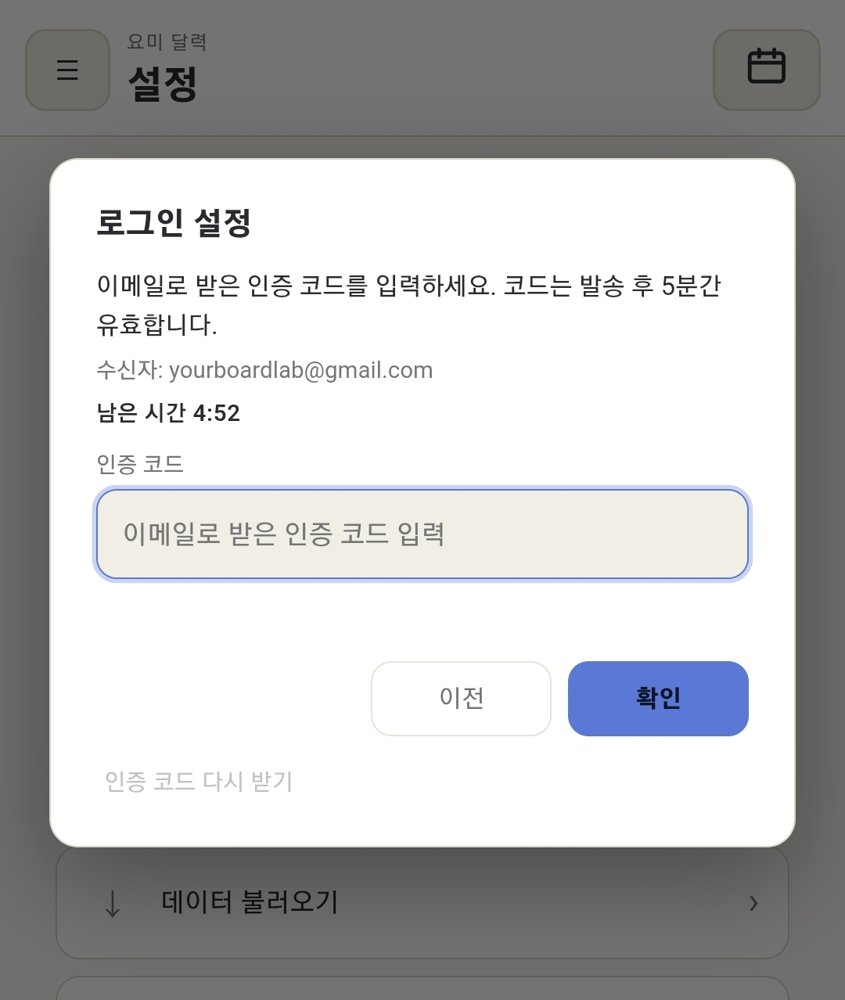
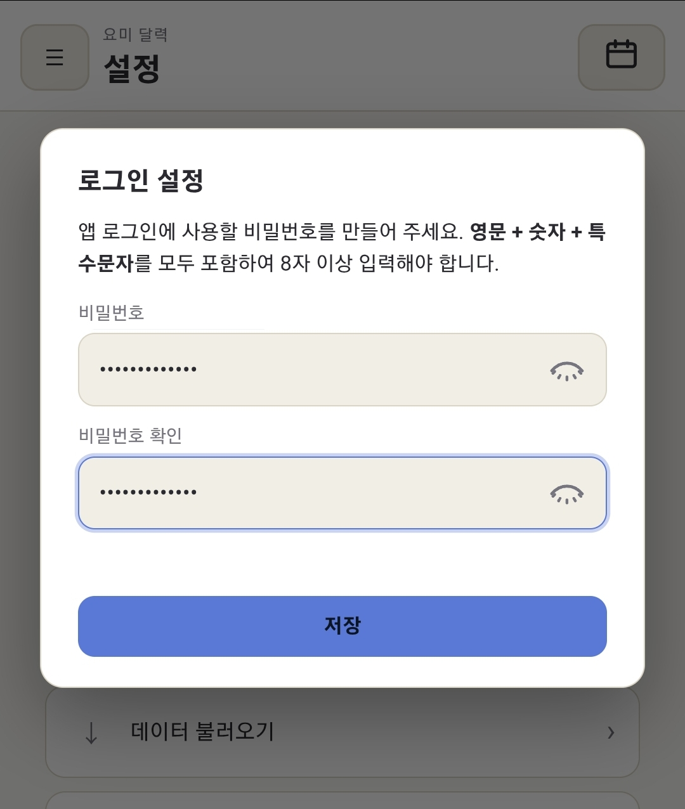
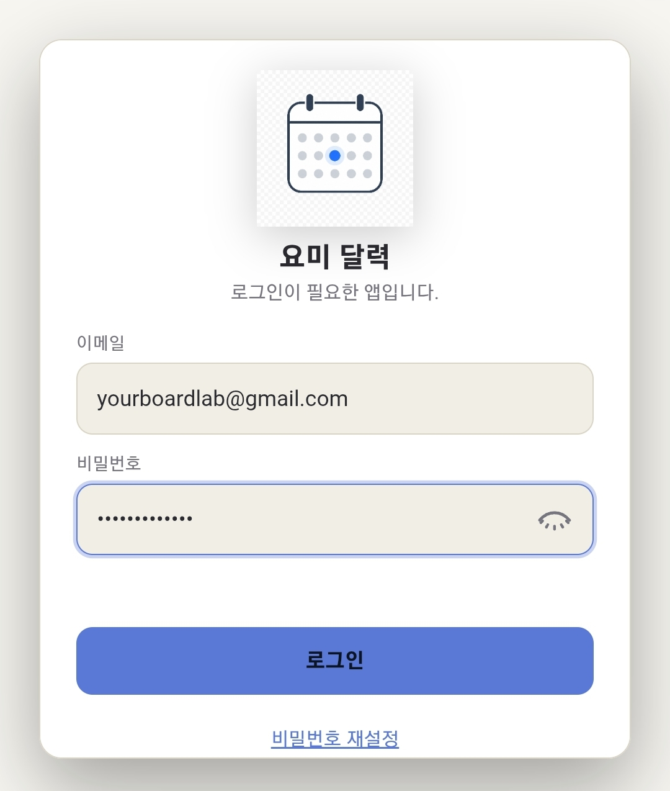
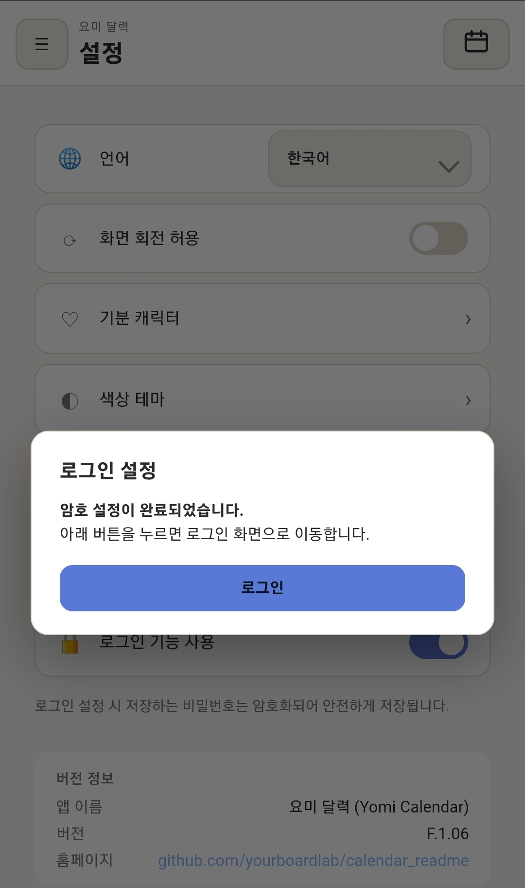

# 요미 달력 · Yomi Calendar

> *A tiny calendar to capture your today — memos, money, todos, scores, and moods, all in one tap.*

<strong><a href="#요미-달력--yomi-calendar">한국어</a> · <a href="#english">English</a></strong>

매일의 작은 순간을 부담 없이 남기고, 한 달이 모이면 내 기분과 습관이 한눈에 보이는 캘린더 앱입니다.
기본은 **계정 없이** 쓰며, 모든 기록은 **내 휴대폰 안에만** 저장됩니다. 원하면 설정에서 **로그인(이메일·비밀번호)** 을 켜 앱 실행 시 잠금을 걸 수 있습니다.

**최신 버전:** **F.1.08** (2026-05-29) — 달력에 오늘은 일정 표시(설정), 썼니 $ 아이콘, 기분 버튼 크기 조정 등 ([변경 이력](#변경-이력-f108))

스토어·런처·위젯 목록에는 **요미 달력**, **Yomi Calendar**, 또는 빌드 설정에 따른 영문 표기가 함께 쓰일 수 있습니다. 이 문서에서는 제품을 **요미 달력**으로 통칭합니다.

  

### 소개 영상

30초짜리 앱 소개 영상은 YouTube에서 볼 수 있습니다.

▶ **[요미 달력 소개 영상 보기](https://youtu.be/QZBNNUx_LD0)**

---

## F.1.08에서 달라진 점 {#f108-highlights}

### 달력에 오늘은 일정 표시 (설정)

달력 한눈에 **오늘의 짧은 메모**를 보고 싶을 때 쓰는 옵션입니다. **설정 → 「달력에 오늘은 일정 표시」** 를 켜면:

- **오늘은**에 글자가 **한 줄이라도 있는 날** → 달력 칸 **가운데**에 기분 캐릭터 대신 **일정 최대 3줄** 표시
- **오늘은**이 비어 있는 날 → 예전처럼 **기분 캐릭터**만 표시 (기분을 골라 둔 경우)
- **날짜 숫자 크기**와 셀 전체 높이는 그대로 — 기분이 쓰던 영역만 재사용
- 글씨는 **홈 위젯**에 오늘은 요약을 넣을 때와 비슷하게 **작지만 굵게**, 한 줄이 길면 말줄임

기본값은 **꺼짐**입니다. 기분 캐릭터 중심으로 쓰다가, “이번 달 일정만 달력에서 훑고 싶다” 할 때 켜 두면 됩니다.

  
  &nbsp;
  

<em>왼쪽: 설정 토글 · 오른쪽: 달력 칸에 표시된 오늘은 텍스트 (최대 3줄)</em>

### 썼니 **$** 아이콘

**썼니(가계부)** 는 상단 카테고리 탭과 각 날짜 셀 **하단 마커**에도 작은 아이콘으로 표시됩니다. F.1.07까지 쓰던 **지폐 모양**은 칸이 작을 때 윤곽이 잘 안 보였습니다. F.1.08부터 **파란색 $ (달러 기호)** 로 바꿔 **썼니** 칸을 더 빨리 구분할 수 있습니다. (오늘은=핑크 하트, 했니=초록 체크, 기록=보라 꺾은선은 그대로입니다.)

### 오늘은 카드 — 기분 버튼 크기

날짜를 눌렀을 때 **오늘은** 카드 헤더 오른쪽 **기분 선택 버튼** 아이콘만 **조금 키웠습니다** (24px → 28px). 달력 칸 가운데 **기분 캐릭터**나 **날짜 숫자** 크기는 바꾸지 않았습니다.

---

## 왜 만들었나요?

일정만 등록해 두고, 알림용으로 **전락한 달력 앱**에 생기를 불어 넣고 싶었습니다.

하루에 가장 중요한 것은, 그날의 **내 기분**이 아닐까 생각해 봤습니다. 앱을 켜고 **귀여운 캐릭터**로 오늘의 내 기분을 표현할 수 있으면 좋겠다고 생각했습니다.

하루 동안 하는 일이라곤—돈 쓰는 일, 숙제나 과제, 프로젝트 같은 **했어야 하는 일**들로 가득 차 있었습니다. 나름 운동을 하는 분들은 그에 맞는 **스코어**도 등록하리라 예상했습니다. 기록하고 싶은 부수적인 것들은, 이 정도면 **하루의 나**를 다 표현할 수 있으리라 생각했습니다.

그냥, 그래서 만들었습니다.

혹시나 누가 볼까 봐, 앱에 **비밀번호**도 설정할 수 있게 해 두었으니, 숨기고 싶은 내용도 마음껏 쓰셔도 됩니다.

이 앱에서 가장 좋은 점은 **광고도, 가입도 없다**는 것입니다. 당신의 휴대폰 안에만 **안전하게 암호화**되어 있으니, 안심하셔도 됩니다.

**이 정도면, 이 앱을 만든 이유는 충분한가요?**

---

## 핵심 기능

### 1. 오늘은 — 하루 한 줄 메모

항목당 **최대 10자**까지 짧게 끊어 오늘을 기록합니다. (처음에는 한글 기준 5자였으나 다국어를 위해 10자로 넓혔습니다.) "회의", "저녁 약속", "야근" 같은 식으로요.
긴 일기가 부담스러운 분에게 가장 잘 맞는 입력 방식입니다.

설정에서 **「달력에 오늘은 일정 표시」** 를 켜면, 오늘은에 적어 둔 항목이 **있는 날**은 달력 칸 가운데에 **기분 캐릭터 대신 일정을 최대 3줄**까지 미리 볼 수 있습니다. (글씨는 홈 위젯 요약과 비슷하게 작지만 읽기 쉽게 표시합니다.) 일정이 없는 날은 기존처럼 기분만 표시됩니다. 기본값은 **꺼짐**입니다. 스크린샷과 자세한 동작은 **[F.1.08에서 달라진 점](#f108-highlights)** 을 참고하세요.

  

### 2. 썼니 — 가벼운 가계부

오늘 쓴 돈을 한 줄씩 적어 두기만 하면 끝. 항목 이름과 금액 두 필드뿐이라 30초면 끝납니다.

  

### 3. 했니 — 하루 체크리스트

오늘 해야 할 일, 또는 매일 반복하는 습관을 체크박스로. 채울 때마다 작은 성취감이 따라옵니다.

  

### 4. 기록 — 무엇이든 숫자로

체중, 운동 횟수, 수면 시간, 공부 시간 — 숫자로 남기고 싶은 건 무엇이든. 같은 항목을 매일 입력하면 추세 그래프가 같이 그려집니다.

  

### 5. 기분 — 캐릭터로 표현하는 오늘의 마음

곰 / 고양이 / 강아지 / 토끼 네 가지 캐릭터 중 하나를 고르고, 각 8가지 표정 (행복 / 슬픔 / 화남 / 사랑 / 놀람 / 졸림 / 웃음 / 부끄러움) 으로 그날의 기분을 남깁니다.

  
  &nbsp;
  

#### 이 달의 기분 배지

이번 달에 가장 많이 선택한 기분이, 달력 상단 **년·월·일** 왼쪽·오른쪽에 **GIF 배지**로 살아 움직입니다.
좌측(큰 배지)은 **1위(가장 많이 기록한 기분)** 이고, **등록 횟수가 같으면 가장 최근에 남긴 기분**이 왼쪽에 크게 표시됩니다.
우측(작은 배지)은 2위 기분입니다. 한 가지 기분만 있으면 좌·우에 같은 캐릭터가 보이고, 한 개도 없는 달은 배지가 숨겨집니다.

  

#### 한 셀에 하루를 다 보여주는 4 모서리 인디케이터

각 날짜 셀의 **네 모서리**에 그날 무엇을 기록했는지 작은 컬러 아이콘으로 표시됩니다.
실제로 글자가 한 줄이라도 적혀 있을 때만 아이콘이 켜지고, 빈 카테고리는 칸이 비워집니다.

| 위치 | 카테고리 | 색 |
|------|----------|------|
| 좌상단 | 오늘은(메모) | 핑크 하트 |
| 우상단 | 썼니(가계부) | 파란 **$** |
| 좌하단 | 했니(체크리스트) | 초록 체크 |
| 우하단 | 기록(숫자 모음) | 보라 꺾은선 |
| 가운데 | 그날의 **기분**(기본) 또는 **오늘은 일정**(설정 ON·항목 있을 때, 최대 3줄) | 캐릭터 PNG / 짧은 텍스트 |

  

### 6. 기록 차트 (월별 요약)

한 달 치 **기분 · 썼니 · 했니 · 기록(숫자)** 를 한 화면에서 볼 수 있는 통계 탭입니다.
접었다 펼 수 있는 카드 형식으로, 기분은 상위 3개 이모티콘 GIF 크기로 한 달 요약을 보여 주고 (1·2·3위 순서대로 점점 작아지는 podium 형태), 썼니/했니는 0을 기준으로 위·아래 막대 + 누적 꺾은선, 기록(숫자)은 항목별 꺾은선으로 표시됩니다. 각 차트 **좌측에는 최고/중간/0/최저 수치가 작게 표시**되어 한눈에 규모를 가늠할 수 있습니다.

  

  

### 7. 홈 화면 위젯 (Android)

안드로이드 **홈 화면**에 **2×2 위젯**을 추가할 수 있습니다. 위젯 목록에서 앱 이름(**요미 달력**, **Yomi Calendar** 등, 기기·스토어·언어에 따라 표시가 다를 수 있음)으로 항목을 찾아 바탕화면에 놓으면 됩니다.

- **내용**: **오늘의 날짜 숫자(일)** 와, 앱에서 마지막으로 맞춰 둔 **기분 캐릭터** 이미지가 보입니다. (홈 위젯 칸을 2×2에 맞추기 위해 년·월 전체 문구는 넣지 않습니다.)
- **Android 12 (API 31) 이상**: 위젯 안에서 기분 **GIF**가 움직이도록 표시됩니다.
- **Android 11 이하**: 홈 위젯에서 GIF 애니메이션을 안정적으로 쓰기 어려운 제약이 있어, **정적인 베어 아이콘**으로 대신 표시됩니다.
- **탭**: 위젯을 누르면 앱이 열립니다. 기분을 바꾼 뒤에는 잠시 후 위젯이 다시 그려지며, 바로 반영이 안 보이면 위젯을 한 번 제거했다가 다시 추가해 보세요.

> 위젯은 **오프라인**에서도 동작하며, 인터넷 연결 없이 휴대폰에 저장된 기분 설정을 읽습니다.

### 8. 로그인 (선택) — F.1.07

**앱을 나만 보고 싶을 때 쓰는 비밀번호 잠금 기능**입니다. (클라우드 **회원 가입이 아닙니다.**) 달력·메모·가계부 내용과 비밀번호 **평문은 어디로도 보내지 않으며**, 비밀번호는 기기 안에 **단방향 해시(PBKDF2-SHA256, 10만 회)** 로만 저장됩니다. 최초 설정·재설정 때에만 **본인 이메일로 인증 코드**가 잠깐 발송됩니다(코드 자체는 서버에 저장하지 않음).

휴대폰을 분실해 저장소에서 **해시만** 빼낸 뒤 무차별 대입한다고 가정할 때의 **대략적인 체감**(비밀번호 종류·도난자 장비에 따라 크게 달라짐):

| 도난자가 쓰는 장비 (오프라인 대입) | 비밀번호 예시 | 대략 걸리는 시간 (순서) |
|----------------------------------|---------------|-------------------------|
| **중급 PC** (6코어급 CPU 또는 일반 GPU) | 정책을 지킨 10~12자, 추측하기 어려운 조합 | **수년 ~ 수십 년 이상** |
| 같은 PC | 8자, 흔한 단어·생일 등 | **며칠 ~ 수개월** |
| **최신 스마트폰만** (PC 없이) | 위와 동일 | PC보다 보통 **수십 배 느림** → 시간 더 김 |

→ **강한 비밀번호**를 쓸수록 분실·도난 후에도 안전 마진이 커집니다. 완전한 보장은 없습니다.

설정 맨 아래 **「로그인 기능 사용」** 을 켜면:

- **설정:** 이메일 입력 → **이메일로 받은 인증 코드** 입력(**발송 후 5분** 유효) → 비밀번호 등록(영문·숫자·특수문자, **8자 이상**)
- **실행 시:** 등록한 이메일·비밀번호로 잠금 해제 후 달력 사용
- **비밀번호 재설정:** 로그인 화면에서 기존 비밀번호 폐기 후, 같은 이메일로 인증·새 비밀번호 등록
- **비밀번호 표시:** 입력 칸 옆 **눈 아이콘**으로 보기/숨기기
- **저장:** 비밀번호는 기기 안에 **암호화된 해시**로만 남고, 평문은 저장되지 않습니다

인증 메일 발송에만 [Vercel `dailylog` 프로젝트](https://vercel.com/yourboardlab-s-projects/dailylog) API를 씁니다. **일기·가계부 본문은 전송하지 않습니다.**

  
  &nbsp;
  

  
  &nbsp;
  

  

---

## 가로 모드 (Landscape)

휴대폰을 옆으로 돌리면 더 많은 정보가 한 화면에 들어옵니다.
**달력 화면**은 좌측 캘린더 + 우측 카드 2단으로, **기록 차트**는 4개 카드가 **2×2 격자**로 펼쳐집니다.

  

### 회전 동작 설정

설정의 **「화면 회전 허용」** 토글로 동작을 고를 수 있습니다. (F.1.08 기준 설정 순서: **언어 → 화면 회전 → 달력에 오늘은 일정 표시 → 기분 캐릭터 → 색상 테마 → 데이터보내기/불러오기 → 로그인**)

| 토글 | 동작 |
|------|------|
| **OFF (기본)** | 휴대폰을 돌려도 **항상 세로 모드** 유지 |
| **ON** | 휴대폰 회전 따라 **세로 ↔ 가로 자동 전환** |

안드로이드(Capacitor) 빌드에서는 **Activity 방향**과 웹 화면 설정을 같이 맞춥니다. 일부 WebView 에서 브라우저 회전 API 가 무시되더라도, 회전을 끈 상태에서는 **가로 전용 달력·차트 레이아웃**이 잘못 켜지지 않도록 보완되어 있습니다.

---

## 색상 테마

다크 모드와 라이트 모드 사이의 어딘가 — **파스텔 톤 8가지**.
midnight / paper / mint / peach / lavender / sky / rose / sand 중에서 그날의 기분에 맞게 골라 보세요.

> 이 페이지의 스크린샷은 모두 **paper(라이트)** 톤으로 캡처되었습니다.

  

---

## 다국어 지원 (Languages)

기본은 한국어이지만 설정의 **언어** 콤보박스에서 다음 언어로 한 번에 전환할 수 있습니다.
콤보박스의 옵션 라벨은 각 언어의 **자국어 표기**로 표시되어, 다른 나라 언어를 잘 모르더라도 자기 모국어를 한눈에 찾을 수 있습니다.

영어는 **미국·영국 공휴일**을 각각 쓰도록 두 가지로 나뉩니다. 화면 문구(카드 이름 등)는 동일한 영어 사전을 쓰고, **달력에 쓰이는 공휴일 목록만** US / GB 로 갈립니다.

| 언어 | 콤보박스 표시 | 카드 4종 |
|------|----------------|----------|
| 한국어 (기본) | 한국어 | 오늘은 / 썼니 / 했니 / 기록 |
| English (American) | English (American) | Today / Spent? / Done? / Stats |
| English (British) | English (British) | Today / Spent? / Done? / Stats |
| 中文 | 中文 | 今天 / 花了？ / 做了？ / 记录 |
| 日本語 | 日本語 | 今日は / 使った？ / やった？ / 記録 |
| Tagalog | Tagalog | Ngayon / Gastos? / Tapos na? / Tala |
| Tiếng Việt | Tiếng Việt | Hôm nay / Tiêu? / Xong chưa? / Số liệu |
| Русский | Русский | Сегодня / Потратил? / Сделал? / Записи |
| Español | Español | Hoy / ¿Gasté? / ¿Hecho? / Registros |
| Deutsch | Deutsch | Heute / Ausgegeben? / Erledigt? / Werte |
| Français | Français | Aujourd'hui / Dépensé ? / Fait ? / Suivi |

> "오늘은"·"기록"은 일상어 그대로 옮겼고, **"썼니"·"했니"의 짧고 캐주얼한 어감**은 각 언어에서도 짧은 의문형으로 살렸습니다 (Spent? / Done?, 使った？ / やった？ 등).  
> 예전에 저장된 데이터에 `English` 한 가지만 있었다면, 앱이 자동으로 **English (American)** 으로 바꿉니다.

설정 화면의 **언어** 행은 토글 스위치와 맞춘 **둥근 콤보** 형태로 표시되어, 기기 기본 `select` 느낌과 구분됩니다.

### 달력: 요일 색과 국가별 공휴일

- **일요일** 날짜 숫자는 **붉은색**, **토요일**은 **파란색**으로 표시합니다.
- **공휴일**이 있는 날은 날짜 숫자도 **붉은색**으로 강조합니다. (토요일이면서 공휴일이면 공휴일 색이 우선합니다.) 셀 **맨 아래**에는 해당 국가 API가 내려주는 **현지 이름**을 짧게 붙입니다. 예를 들어 한국어 설정이면 **「추석」**처럼 한글 표기가 나올 수 있고, 같은 날 여러 공휴일이면 ` · ` 로 이어서 보여 줍니다.
- 공휴일 목록은 [Nager.Date](https://date.nager.at) 공개 API(연도·국가 코드 단위)를 사용합니다. **해당 연도·국가를 처음 볼 때** 한 번 네트워크로 받아 오며, 이후에는 기기에 **캐시**되어 같은 달을 다시 열 때는 끊긴 상태에서도 표시가 유지되는 경우가 많습니다. **언어**를 바꾸거나 **달력의 연·월**을 바꾸면 필요한 연도를 자동으로 다시 맞춥니다.

**언어(콤보박스) → 공휴일 기준 국가**

| 언어(콤보박스) | 공휴일 API 국가 코드 |
|----------------|----------------------|
| 한국어 | KR |
| English (American) | US |
| English (British) | GB |
| 中文 | CN |
| 日本語 | JP |
| Tagalog | PH |
| Tiếng Việt | VN |
| Русский | RU |
| Español | ES |
| Deutsch | DE |
| Français | FR |

---

## 데이터는 어디 저장되나요?

- **달력·메모·가계부·기분 등 기록은 전부 휴대폰 안에만** 저장됩니다. 일기 본문은 서버로 보내지 않습니다.
- **로그인은 선택**입니다. 켠 경우 이메일·**암호화된 비밀번호 해시**·마지막 로그인 이메일만 기기에 남습니다. 클라우드 회원가입·동기화·광고 추적은 없습니다.
- 백업이 필요할 땐 **설정 → 내보내기** 로 기록을 **하나의 ZIP 파일**로 저장할 수 있고, **불러오기** 로 새 기기에서 그대로 복원할 수 있습니다.

  

---

## English {#english}

# Yomi Calendar · 요미 달력

> *A tiny calendar to capture your today — memos, money, todos, scores, and moods, all in one tap.*

<strong><a href="#요미-달력--yomi-calendar">한국어</a> · <a href="#english">English</a></strong>

Yomi Calendar helps you log small daily moments without pressure. When a month fills up, your moods and habits become visible at a glance.
By default there is **no account** — everything stays **on your phone only**. Optionally enable **sign-in (email + password)** in Settings to lock the app on launch.

**Latest release:** **F.1.08** (2026-05-29) — optional **Today items on calendar** (Settings), clearer **$** ledger icon, slightly larger mood button on Today card ([changelog](#changelog-f108-en)).

The app may appear as **요미 달력**, **Yomi Calendar**, or another localized name in the store, launcher, and widget picker.

### Why Yomi Calendar?

I wanted to breathe life back into calendar apps that had become little more than **schedules and notification reminders**.

What matters most in a day, I thought, is **how you felt**. I wanted you to open the app and express today’s mood with **cute characters**.

A day is also full of the things you actually do—**spending money**, homework and assignments, **projects** you need to finish. People who exercise might log **scores** that fit their routine. I figured that much—on top of mood—was enough to capture **who you were that day**.

So I built it. That’s really the reason.

If you’re worried someone might peek, you can set an **app password** and write what you’d rather keep private.

The best parts, to me: **no ads, no sign-up**. Everything stays **encrypted on your phone**—you can use it with peace of mind.

**Is that enough of a reason this app exists?**

### What's new in F.1.08 {#f108-highlights-en}

#### Show Today items on calendar (Settings)

Turn on **Settings → 「Show Today items on calendar」** when you want **short Today memos** visible on the month grid:

- **Any Today line that day** → up to **3 lines** in the **center** of the cell instead of the mood character
- **No Today entries** → mood character only (if you picked one)
- **Date number size** and cell layout unchanged — only reuses the mood area
- Text is **small but bold**, like the home widget summary; long lines ellipsize

**Off by default.** Keep mood-first; flip it on when you want a quick scan of the month’s memos.

  
  &nbsp;
  

<em>Left: Settings toggle · Right: Today lines on the calendar (up to 3)</em>

#### Clearer **$** icon for Spent? (ledger)

**Spent?** appears on the top category tabs and on each day’s **bottom marker row**. The old **banknote** icon was hard to read in tiny cells. F.1.08 uses a **blue $** so ledger days stand out. (Today=pink heart, Done?=green check, Stats=purple line chart unchanged.)

#### Slightly larger mood button on the Today card

The **mood picker** in the **Today** card header is a bit larger (24px → 28px). Calendar **day numbers** and **center mood characters** are unchanged.

---

### This month's mood badges

Animated **GIF badges** at the top of the calendar show your top moods for the month.
The **large left badge** is **#1 (most logged)**. If counts are **tied**, the **most recently logged mood** wins on the left.
The **small right badge** is **#2**. One mood only → same character on both sides; none logged → badges hidden.

### Today on the calendar (F.1.08)

In Settings, turn on **「Show Today items on calendar」** to preview up to **3 short Today lines** in the center of a day cell **when you have entries**—instead of the mood character. Days without entries still show mood. Off by default. Date numbers and cell layout stay the same. See **[What's new in F.1.08](#f108-highlights-en)** for screenshots and details.

### 7. Home-screen widget (Android)

Add a **1×1 widget** on your **Android home screen**. Find the app (**요미 달력**, **Yomi Calendar**, etc.) in the widget list and place it on your launcher.

- **Shows:** today's **day-of-month number** and the **mood character** you last set in the app.
- **Android 12+ (API 31):** mood **GIF** animates in the widget.
- **Android 11 and below:** static **bear icon** (GIF in home widgets is unreliable on older versions).
- **Tap:** opens the app. After changing mood, the widget redraws shortly; remove and re-add if it looks stale.

> Works **offline**; reads mood settings stored on the device.

### 8. Sign-in (optional) — F.1.07

An **optional app lock** — **not** a cloud account. Your calendar entries and password **plaintext never leave the device**; the password is stored **encrypted on-device**. A **one-time verification code** is emailed only when you set up or reset the lock.

If someone steals the phone and extracts only the **encrypted hash** for offline guessing (rough sense; varies by password and hardware):

| Attacker hardware (offline) | Example password | Rough time (order of magnitude) |
|-----------------------------|------------------|----------------------------------|
| **Mid-range PC** (6-core CPU or consumer GPU) | Strong 10–12 chars, hard to guess | **Years to decades+** |
| Same PC | 8 chars, common words/birthdays | **Days to months** |
| **Phone only** (no PC) | Same as above | Often **~10× slower** than a PC → longer |

Stronger passwords improve safety after loss or theft; there is no absolute guarantee.

Turn on **「Use sign-in」** at the bottom of Settings:

- **Setup:** email → enter **verification code from email** (valid **5 minutes** after send) → password (letters, numbers, symbols, **8+ chars**)
- **Launch:** unlock with registered email + password
- **Reset:** discard old password on the sign-in screen → verify same email → new password
- **Show password:** **eye icon** beside fields
- **Storage:** **encrypted hash only** on device; plaintext is never stored

Verification email uses the [Vercel `dailylog` project](https://vercel.com/yourboardlab-s-projects/dailylog) API only. **Diary and ledger bodies are never sent.**

  
  &nbsp;
  

  
  &nbsp;
  

  

### Landscape mode

Rotate for more on screen: **calendar** = calendar left + cards right; **monthly charts** = **2×2** card grid.

**Allow screen rotation** in Settings (F.1.08 order: **Language → rotation → show Today on calendar → mood character → theme → export/import → sign-in**).

| Toggle | Behavior |
|--------|----------|
| **OFF (default)** | Always **portrait** |
| **ON** | **Portrait ↔ landscape** follows device rotation |

### Where is my data?

- **All entries stay on your device.** Diary text is not uploaded.
- **Sign-in is optional.** When enabled, only email, **encrypted password hash**, and last sign-in email are stored on-device. No cloud signup, sync, or ad tracking.
- **Export → ZIP (v4)** in Settings; from F.1.07 includes **settings + sign-in (hash)**. **Import** on a new device restores everything.

### FAQ (English)

**Q. Does it work offline?**  
Yes for memos, ledger, checklist, stats, moods, and the widget. Public holidays may need one online fetch per year/country, then cache locally.

**Q. Move data to another phone?**  
**Export → ZIP**, then **Import** on the new device. ZIP v4 includes settings and optional sign-in hash; use the same password to unlock if sign-in was enabled.

**Q. Must I sign in?**  
No — off by default. Enable in Settings when you want an app lock.

**Q. Verification email not arriving?**  
Check network, spam, and typos. Sent via [Vercel dailylog](https://vercel.com/yourboardlab-s-projects/dailylog); heavy use may be rate-limited.

**Q. Home widget?**  
Long-press the home screen → **Widgets** → add this app's **1×1** widget. See **§7** above.

### Changelog (F.1.08) {#changelog-f108-en}

| Version | Date | Summary |
|---------|------|---------|
| **F.1.08** | 2026-05-29 | Show Today items on calendar (Settings), $ ledger icon, larger Today mood button |
| **F.1.07** | 2026-05-27 | Optional sign-in, ZIP v4, settings UI, mood badge tie→recent, icon readability |
| F.1.06 | 2026-05 | Widget stability Android 14–16, calendar swipe UX |
| F.1.04 | 2026-05-19 | Holidays API, home widget, landscape |

### Changelog (F.1.07) {#changelog-f107-en}

| Version | Date | Summary |
|---------|------|---------|
| **F.1.07** | 2026-05-27 | Optional sign-in, ZIP v4, settings UI, mood badge tie→recent, icon readability |
| F.1.06 | 2026-05 | Widget stability Android 14–16, calendar swipe UX |
| F.1.04 | 2026-05-19 | Holidays API, home widget, landscape |

Code release notes: [yourboardlab/dailylog `release.txt`](https://github.com/yourboardlab/dailylog/blob/main/release.txt)

---

## 개인정보처리방침 · Privacy Policy

> **Google Play 등 스토어 등록용 공개 URL**  
> `https://github.com/yourboardlab/calendar_readme#개인정보처리방침--privacy-policy`  
> **최종 업데이트:** 2026-05-29 · **앱:** 요미 달력 (Yomi Calendar) **F.1.08** · **운영:** yourboardlab

### 한국어

**1. 개요**  
yourboardlab(이하 “개발자”)이 제공하는 **요미 달력**(Yomi Calendar)은 사용자가 직접 입력한 일기·메모·가계부·체크·기록·기분 데이터를 **사용자 기기 안에만** 저장하는 앱입니다. **로그인은 선택**이며, 켠 경우에만 이메일·비밀번호 해시가 기기에 저장됩니다. 인증 코드 메일 발송 시 [Vercel dailylog](https://vercel.com/yourboardlab-s-projects/dailylog) API를 사용하며, 일기 본문은 전송하지 않습니다. 클라우드 동기화·광고 식별자 추적은 하지 않습니다.

**2. 수집·처리하는 정보**

| 구분 | 내용 | 저장 위치 |
|------|------|-----------|
| 사용자 입력 | 메모(오늘은), 가계부(썼니), 체크(했니), 숫자 기록, 기분, 설정(테마·언어·회전 등) | 기기 내부 저장소만 |
| 로그인(선택) | 이메일, 비밀번호 **해시**, 마지막 로그인 이메일 | 기기 내부 저장소만 |
| 인증 메일 | 로그인 가입·재설정 시 **이메일 주소·인증 코드·서명** | Vercel `dailylog` → SMTP (본문은 사용자 메일함만) |
| 백업 파일 | 설정에서 **데이터보내기** 시 사용자가 만든 ZIP(v4) | 사용자가 선택한 위치(파일 앱 등) |
| 공휴일 조회 | 설정 언어에 대응하는 **국가 코드**와 **연도** | 공휴일 API 요청 시에만 전송(아래 3항) |
| 위젯 표시 | 오늘 날짜·기분·오늘은·체크 요약 등 앱과 동기화한 최소 정보 | 기기 내부(Android 위젯용 설정) |

개발자는 **이름, 이메일, 전화번호, 위치, 연락처, 사진** 등을 앱 안에서 수집하지 않습니다.

**3. 제3자 서비스**  
- **공휴일 API:** [Nager.Date](https://date.nager.at) 공개 API를 사용합니다. 달력에 해당 연도·국가의 공휴일 이름을 표시하기 위해 **연도·국가 코드** 수준의 요청이 이루어질 수 있습니다. 사용자가 작성한 메모 본문 등은 전송하지 않습니다.  
- 응답은 기기에 **캐시**되어, 이후 같은 연·월을 볼 때 네트워크 없이도 표시될 수 있습니다.

**4. 이용 목적**  
- 앱 기능 제공(달력 표시, 기록·차트, 홈 화면 위젯, 알람 알림 등)  
- 사용자 설정 반영(언어, 테마, 기분 캐릭터 등)  
- 사용자가 요청한 **보내기·불러오기**

**5. 보관 기간**  
- 앱 데이터: 사용자가 **삭제·앱 제거·데이터 초기화**할 때까지 기기에 보관됩니다.  
- 공휴일 캐시: 기기 내부에 일정 기간 보관 후 갱신될 수 있습니다.

**6. 제3자 제공·판매**  
개발자는 사용자 데이터를 **판매하거나**, 광고 목적으로 **제3자와 공유하지 않습니다.**

**7. 권한 (Android)**  
| 권한 | 용도 |
|------|------|
| 인터넷 | 공휴일 API 조회(해당 기능 사용 시) |
| 부팅 완료 수신 | 홈 화면 위젯 날짜 갱신 |
| 정확한 알람 | 사용자가 설정한 **알람** 알림 예약 |

**8. 아동**  
앱은 만 13세 미만을 대상으로 설계되지 않았으며, 개발자는 아동의 개인정보를 고의로 수집하지 않습니다.

**9. 국제 이전**  
사용자 입력 데이터는 사용자 기기에만 남습니다. 공휴일 API 요청 시 해당 API 운영자의 서버가 해외에 있을 수 있습니다.

**10. 이용자 권리**  
- 앱 **설정 →보내기**로 데이터를 ZIP으로 받을 수 있습니다.  
- **불러오기**·앱 삭제·기기 초기화로 데이터를 지울 수 있습니다.  
- 문의: **yourboardlab@gmail.com**

**11. 정책 변경**  
중요한 변경 시 이 README를 갱신하고, 필요한 경우 앱 또는 스토어를 통해 안내할 수 있습니다.

---

### English

**1. Overview**  
**Yomi Calendar** (요미 달력), operated by **yourboardlab** (“we”, “developer”), stores the records you enter—memos, ledger lines, checklists, numeric logs, and moods—**on your device only**. **Sign-in is optional**; when enabled, only your email and **encrypted password hash** stay on the device. Verification emails use the [Vercel dailylog](https://vercel.com/yourboardlab-s-projects/dailylog) API; diary and ledger bodies are never sent. We do not offer cloud sync or ad tracking.

**2. Information we process**

| Type | Examples | Where it stays |
|------|----------|----------------|
| Your entries | Memos, expenses, checklists, scores, moods, app settings | On-device storage only |
| Sign-in (optional) | Email, **encrypted password hash**, last sign-in email | On-device storage only |
| Verification email | Email address, verification code, signature when you set up or reset sign-in | Vercel `dailylog` → SMTP (delivered to your mailbox only) |
| Backup ZIP | ZIP **v4** created when you tap **Export** in Settings (includes settings + optional sign-in hash) | Where you save the file |
| Public holidays | **Country code** and **year** derived from your language setting | Sent only when calling the holiday API (see §3) |
| Home widget | Today’s date, mood, short memo/checklist summaries synced from the app | On-device (Android widget preferences) |

We do **not** collect your name, phone number, contacts, photos, or precise location inside the app. We do **not** collect email inside the app except when you optionally enable sign-in.

**3. Third-party services**  
- **Holiday API:** We use the public [Nager.Date](https://date.nager.at) API to show public holiday names on the calendar. Requests may include **year** and **country code** only—not the text of your memos.  
- Responses may be **cached on your device** for offline reuse.

**4. Purposes**  
- Provide app features (calendar, charts, home-screen widget, alarm notifications)  
- Apply your preferences (language, theme, mood character, etc.)  
- **Import / export** when you choose

**5. Retention**  
- App data remains on your device until you delete it, clear app data, or uninstall.  
- Holiday cache may expire and refresh over time.

**6. Sharing / sale**  
We **do not sell** your data or share it with third parties for advertising.

**7. Android permissions**

| Permission | Purpose |
|------------|---------|
| Internet | Fetch public holidays when needed |
| Receive boot completed | Refresh the home-screen widget date |
| Schedule exact alarms | Deliver **alarms** you set in the app |

**8. Children**  
The app is not directed at children under 13, and we do not knowingly collect their personal information.

**9. International transfers**  
Your entries stay on your device. Holiday API requests may reach servers operated outside your country.

**10. Your choices**  
- **Export** your data as a ZIP from Settings.  
- **Import**, uninstall, or reset the app to remove data.  
- Contact: **yourboardlab@gmail.com**

**11. Changes**  
We may update this policy by revising this README and, when appropriate, notifying users via the app or store listing.

---

## 지원 / 문의

- 사용 중 문제, 새로운 기분 캐릭터 / 테마 제안, 혹은 단순한 후기 — 모두 환영합니다.
- 이슈 등록: [Issues 탭](https://github.com/yourboardlab/calendar_readme/issues/new) 에 자유롭게 글을 남겨 주세요.
  - 제목 한 줄과 어떤 화면에서 일어난 일인지만 적어 주시면 충분합니다.
- 비지니스 및 문의 사항은 e-mail 주소 : **yourboardlab@gmail.com** 으로 연락 바랍니다.
- 홈페이지: [yourboardlab.github.io](https://yourboardlab.github.io/)
- 소개 영상: [YouTube — 요미 달력 소개](https://youtu.be/QZBNNUx_LD0)
- 개인정보처리방침: [이 README의 개인정보처리방침 섹션](https://github.com/yourboardlab/calendar_readme#개인정보처리방침--privacy-policy)

---

## FAQ

**Q. 인터넷 연결이 끊겨도 쓸 수 있나요?**
네. 메모·가계부·체크·기록·기분·위젯 등 **핵심 기능은 오프라인**에서 동작합니다. 다만 **국가별 공휴일** 이름을 달력에 처음 채울 때는 공휴일 API 를 한 번 불러와야 하므로 그 순간만 **인터넷이 있으면** 좋고, 받아 둔 연도·국가 조합은 기기에 잠시 **캐시**됩니다.

**Q. iOS 버전은 언제 나오나요?**
현재까지는 계획이 없습니다. iOS 버전을 개발하기 위해서는 추가 개발 비용이 발생합니다. 필요하신 분은 e-mail 로 문의해 주세요.

**Q. 데이터가 다른 기기로 옮겨지나요?**  
설정에서 **데이터보내기 → ZIP** 으로 백업한 뒤, 새 기기에서 **데이터 불러오기**로 복원하세요. F.1.07부터 ZIP에 **설정과 로그인(해시)** 도 포함됩니다. 로그인을 켜 두었다면 같은 비밀번호로 바로 잠금 해제할 수 있습니다.

**Q. 로그인을 꼭 써야 하나요?**  
아니요. 기본은 로그인 없이 사용합니다. 원할 때만 설정에서 켜면 됩니다.

**Q. 인증 메일이 안 와요.**  
인터넷·스팸함·이메일 오타를 확인해 주세요. 발송은 [Vercel dailylog](https://vercel.com/yourboardlab-s-projects/dailylog) 백엔드를 쓰며, 과도한 요청 시 일시 제한될 수 있습니다.

**Q. 사용료가 있나요?**
광고없는 무료 앱입니다. 마음껏 사용하세요.

**Q. 홈 화면 위젯은 어떻게 쓰나요?**
안드로이드에서 바탕화면을 길게 누른 뒤 **위젯**을 선택하고, 목록에서 이 앱의 위젯을 찾아 추가하면 됩니다. Android 12 이상에서는 기분 GIF가, 그보다 낮은 버전에서는 정적 아이콘이 보입니다. 자세한 동작은 위 **「7. 홈 화면 위젯 (Android)」** 항목을 참고하세요.

**Q. 새로운 기능을 추가해 주실 수 있나요?**
추가적인 기능 개발은 개발비용이 발생합니다. e-mail 로 문의해 주세요.

---

## 변경 이력 (F.1.08) {#변경-이력-f108}

| 버전 | 날짜 | 요약 |
|------|------|------|
| **F.1.08** | 2026-05-29 | 달력에 오늘은 일정 표시(설정), 썼니 $ 아이콘, 오늘은 기분 버튼 크기 조정 |
| **F.1.07** | 2026-05-27 | 선택 로그인(이메일 인증·재설정), ZIP v4(설정·로그인 포함), 설정 UI 정리, 월 기분 배지 동률→최근 우선, 아이콘 가독성 |
| F.1.06 | 2026-05 | Android 14~16 위젯 안정화, 달력 스와이프·월 이동 UX |
| F.1.04 | 2026-05-19 | 공휴일 API, 홈 위젯, 가로 모드 |

## 변경 이력 (F.1.07) {#변경-이력-f107}

| 버전 | 날짜 | 요약 |
|------|------|------|
| **F.1.07** | 2026-05-27 | 선택 로그인(이메일 인증·재설정), ZIP v4(설정·로그인 포함), 설정 UI 정리, 월 기분 배지 동률→최근 우선, 아이콘 가독성 |
| F.1.06 | 2026-05 | Android 14~16 위젯 안정화, 달력 스와이프·월 이동 UX |
| F.1.04 | 2026-05-19 | 공휴일 API, 홈 위젯, 가로 모드 |

코드 저장소 릴리스 노트: [yourboardlab/dailylog `release.txt`](https://github.com/yourboardlab/dailylog/blob/main/release.txt)

---

## 라이선스 / 저작권

- 앱 자체의 코드 라이선스는 별도 비공개 저장소에서 관리됩니다.
- 이 저장소(`calendar_readme`)의 텍스트와 스크린샷은 © 2026 yourboardlab. All rights reserved.
- 사용된 캐릭터 자산은 yourboardlab 의 PNG/GIF 입니다.

---

  <em>오늘을 가볍게 남기는 습관이, 어느 날 가장 따뜻한 기록이 됩니다.</em>

