# Lifelong Calendar — 오늘을 기록하는 작은 달력

> *A tiny lifelong calendar to capture your today — memos, money, todos, scores, and moods, all in one tap.*

매일의 작은 순간을 부담 없이 남기고, 한 달이 모이면 내 기분과 습관이 한눈에 보이는 캘린더 앱입니다.
계정 가입도 클라우드도 없고, 모든 기록은 **내 휴대폰 안에서만** 살아갑니다.

  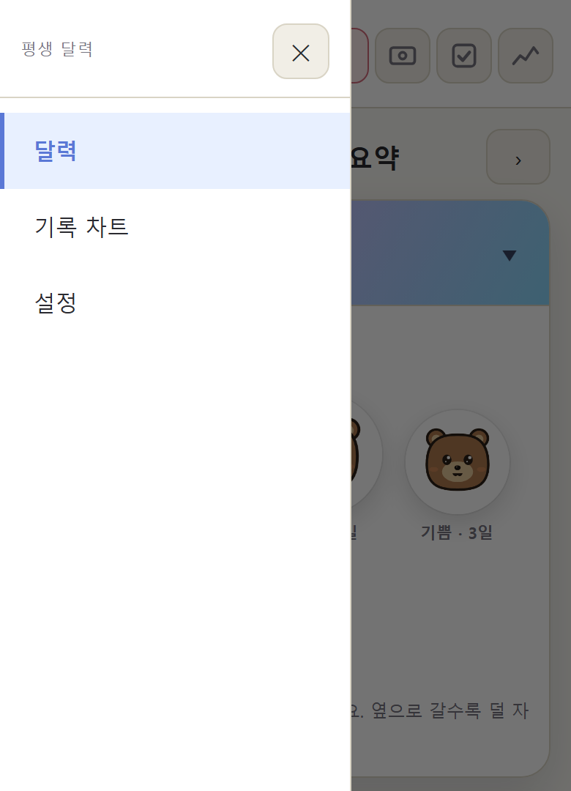

---

## 왜 만들었나요?

다이어리 앱들은 보통 둘 중 하나입니다.

- 너무 화려해서 매일 켜기 부담스럽거나,
- 너무 단순해서 한 달 뒤 돌아보면 아무 의미가 없거나.

**요미 달력 (Yomi Calendar)** 는 그 중간을 노렸습니다.
한 번에 한 문장, 한 줄짜리 지출, 체크박스 하나, 점수 하나 — 그리고 가장 중요한 **오늘의 기분**.
이만큼만 매일 남기면, 한 달이 모일 즈음 달력 안에서 자기 자신이 보입니다.

---

## 핵심 기능

### 1. 오늘은 — 하루 한 줄 메모

5자 이내의 짧은 항목 단위로 오늘을 기록합니다. "회의", "저녁 약속", "야근" 같은 식으로요.
긴 일기가 부담스러운 분에게 가장 잘 맞는 입력 방식입니다.

  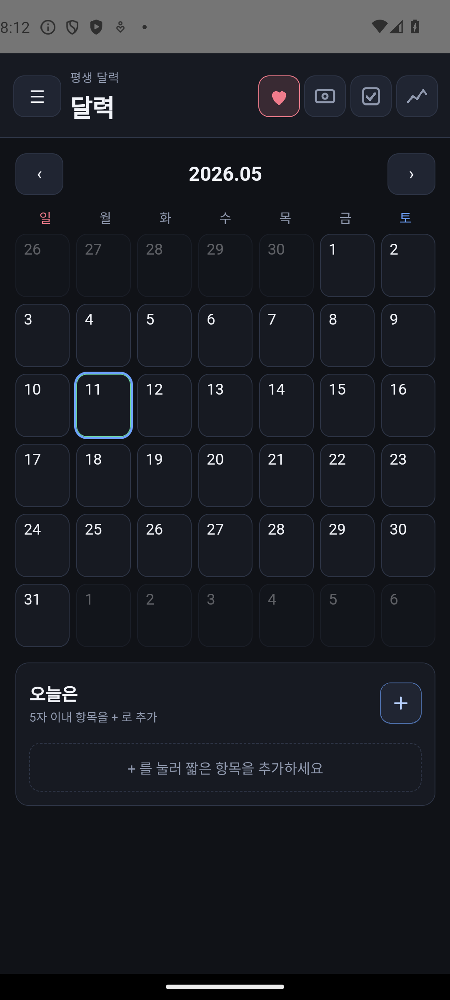

### 2. 썼니 — 가벼운 가계부

오늘 쓴 돈을 한 줄씩 적어 두기만 하면 끝. 항목 이름과 금액 두 필드뿐이라 30초면 끝납니다.

  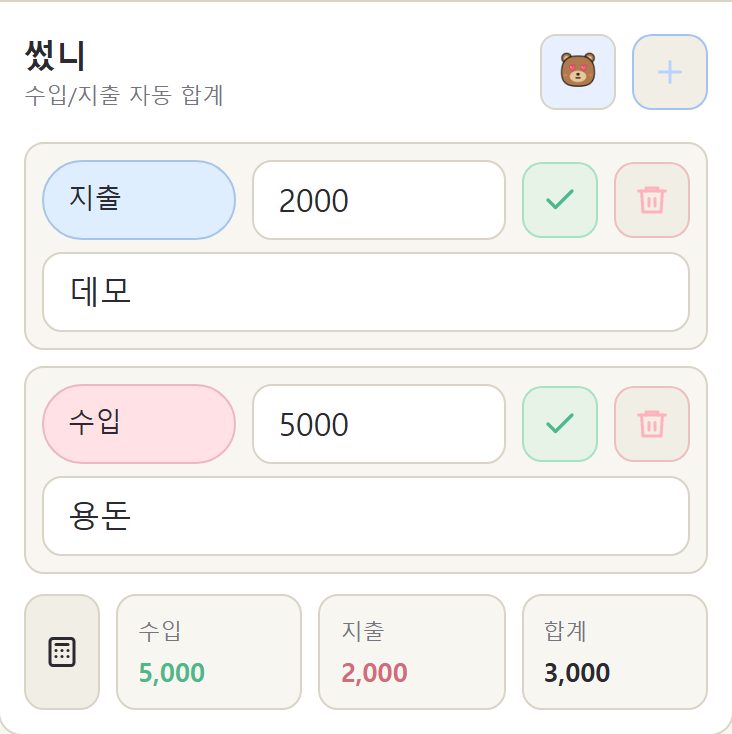

### 3. 했니 — 하루 체크리스트

오늘 해야 할 일, 또는 매일 반복하는 습관을 체크박스로. 채울 때마다 작은 성취감이 따라옵니다.

  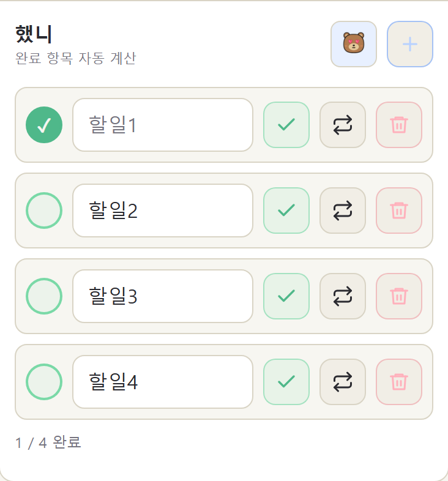

### 4. 기록 — 무엇이든 숫자로

체중, 운동 횟수, 수면 시간, 공부 시간 — 숫자로 남기고 싶은 건 무엇이든. 같은 항목을 매일 입력하면 추세 그래프가 같이 그려집니다.

  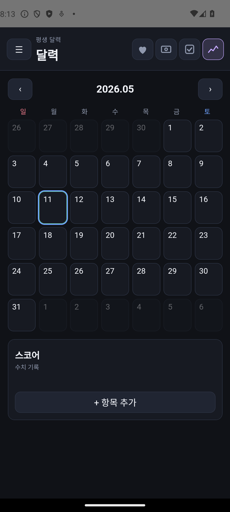

### 5. 기분 — 캐릭터로 표현하는 오늘의 마음

곰 / 고양이 / 강아지 / 토끼 네 가지 캐릭터 중 하나를 고르고, 각 8가지 표정 (행복 / 슬픔 / 화남 / 사랑 / 놀람 / 졸림 / 웃음 / 부끄러움) 으로 그날의 기분을 남깁니다.

  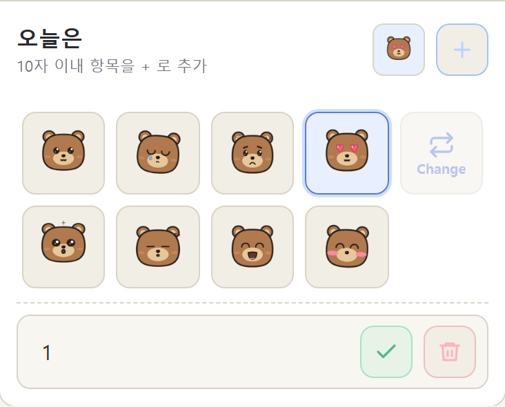
  &nbsp;
  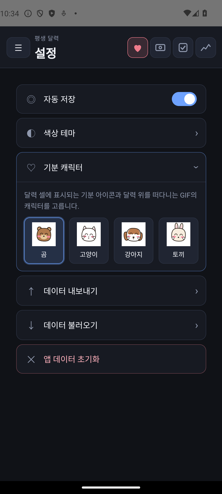

#### 이 달의 기분 배지

이번 달에 가장 많이 선택한 기분이, 달력 상단 월 이름 옆에 **GIF 배지**로 살아 움직입니다.
좌측에는 가장 자주 고른 1위 기분이 큰 사이즈로, 우측에는 그 다음 2위 기분이 작은 사이즈로 표시됩니다.
한 가지 기분만 등록되어 있다면 좌·우에 같은 캐릭터가 같이 보이고, 한 개도 없는 달은 아예 표시되지 않습니다.

  

#### 한 셀에 하루를 다 보여주는 4 모서리 인디케이터

각 날짜 셀의 **네 모서리**에 그날 무엇을 기록했는지 작은 컬러 아이콘으로 표시됩니다.
실제로 글자가 한 줄이라도 적혀 있을 때만 아이콘이 켜지고, 빈 카테고리는 칸이 비워집니다.

| 위치 | 카테고리 | 색 |
|------|----------|------|
| 좌상단 | 오늘은(메모) | 핑크 하트 |
| 우상단 | 썼니(가계부) | 파란 지폐 |
| 좌하단 | 했니(체크리스트) | 초록 체크 |
| 우하단 | 기록(숫자 모음) | 보라 꺾은선 |
| 가운데 | 그날의 기분(있을 때만) | 캐릭터 PNG |

  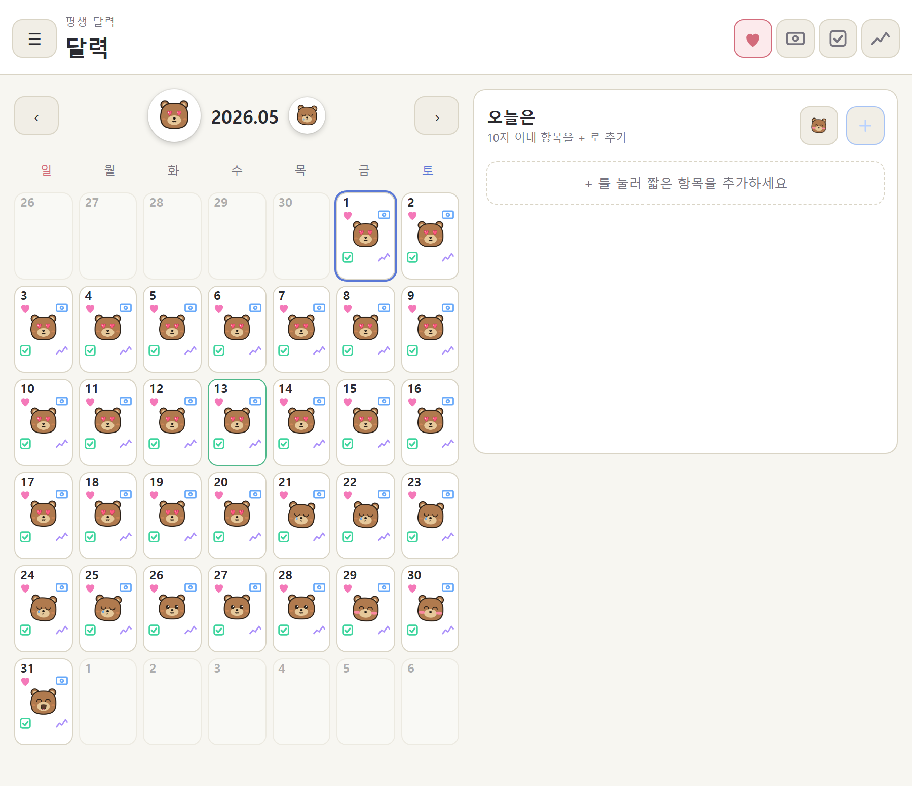

### 6. 기록 차트 (월별 요약)

한 달 치 **기분 · 썼니 · 했니 · 기록(숫자)** 를 한 화면에서 볼 수 있는 통계 탭입니다.
접었다 펼 수 있는 카드 형식으로, 기분은 상위 4개 이모티콘 GIF 크기로 한 달 요약을 보여 주고, 썼니/했니는 0을 기준으로 위·아래 막대 + 누적 꺾은선, 기록(숫자)은 항목별 꺾은선으로 표시됩니다. 각 차트 **좌측에는 최고/중간/0/최저 수치가 작게 표시**되어 한눈에 규모를 가늠할 수 있습니다.

  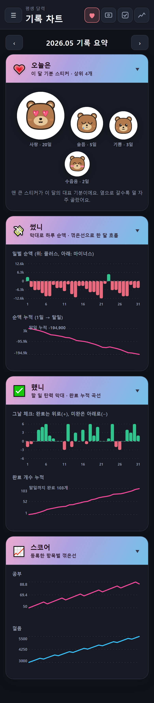

  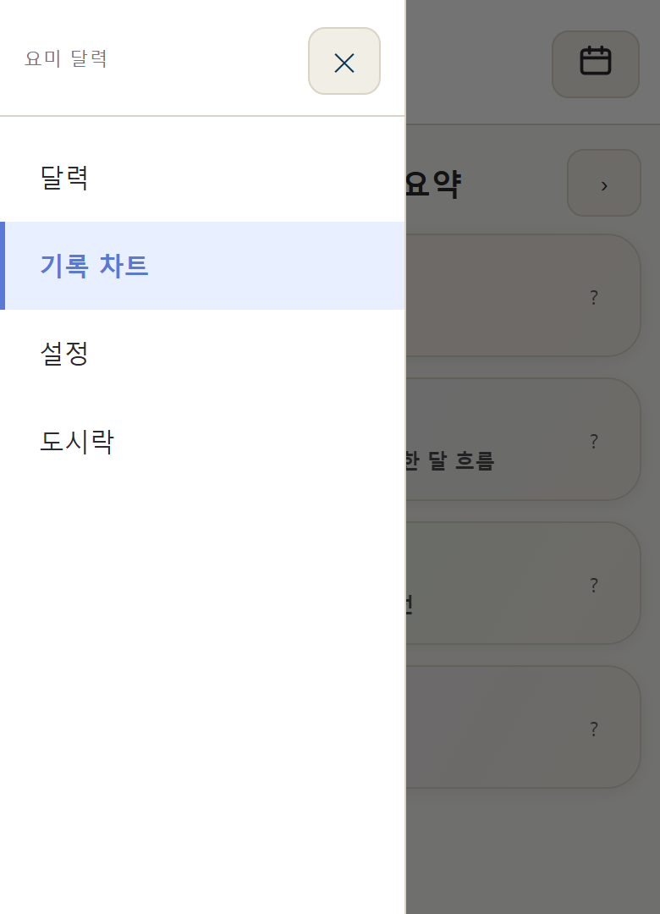

---

## 가로 모드 (Landscape)

휴대폰을 옆으로 돌리면 더 많은 정보가 한 화면에 들어옵니다.
**달력 화면**은 좌측 캘린더 + 우측 카드 2단으로, **기록 차트**는 4개 카드가 **2×2 격자**로 펼쳐집니다.

  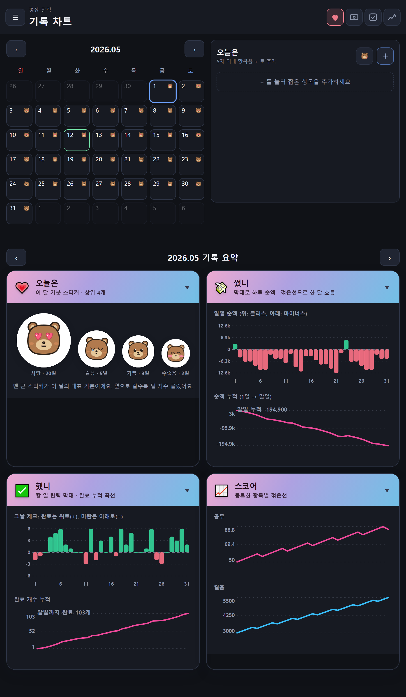

### 회전 동작 설정

설정 화면 상단의 **"화면 회전 허용"** 토글로 동작을 고를 수 있습니다.

| 토글 | 동작 |
|------|------|
| **OFF (기본)** | 휴대폰을 돌려도 **항상 세로 모드** 유지 |
| **ON** | 휴대폰 회전 따라 **세로 ↔ 가로 자동 전환** |

---

## 색상 테마

다크 모드와 라이트 모드 사이의 어딘가 — **파스텔 톤 8가지**.
midnight / paper / mint / peach / lavender / sky / rose / sand 중에서 그날의 기분에 맞게 골라 보세요.

> 이 페이지의 스크린샷은 모두 **paper(라이트)** 톤으로 캡처되었습니다.

  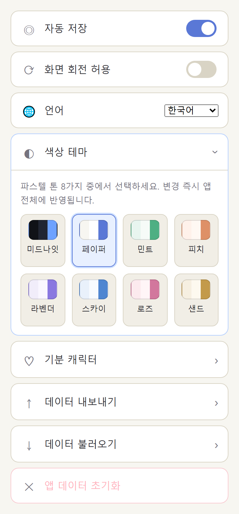

---

## 다국어 지원 (Languages)

기본은 한국어이지만 설정의 **언어** 콤보박스에서 다음 언어로 한 번에 전환할 수 있습니다.
콤보박스의 옵션 라벨은 각 언어의 **자국어 표기**로 표시되어, 다른 나라 언어를 잘 모르더라도 자기 모국어를 한눈에 찾을 수 있습니다.

| 언어 | 콤보박스 표시 | 카드 4종 |
|------|----------------|----------|
| 한국어 (기본) | 한국어 | 오늘은 / 썼니 / 했니 / 기록 |
| English | English | Today / Spent? / Done? / Stats |
| 中文 | 中文 | 今天 / 花了？ / 做了？ / 记录 |
| 日本語 | 日本語 | 今日は / 使った？ / やった？ / 記録 |
| Tagalog | Tagalog | Ngayon / Gastos? / Tapos na? / Tala |
| Tiếng Việt | Tiếng Việt | Hôm nay / Tiêu? / Xong chưa? / Số liệu |
| Русский | Русский | Сегодня / Потратил? / Сделал? / Записи |
| Español | Español | Hoy / ¿Gasté? / ¿Hecho? / Registros |
| Deutsch | Deutsch | Heute / Ausgegeben? / Erledigt? / Werte |
| Français | Français | Aujourd'hui / Dépensé ? / Fait ? / Suivi |

> "오늘은"·"기록"은 일상어 그대로 옮겼고, **"썼니"·"했니"의 짧고 캐주얼한 어감**은 각 언어에서도 짧은 의문형으로 살렸습니다 (Spent? / Done?, 使った？ / やった？ 등).

---

## 데이터는 어디 저장되나요?

- **전부 휴대폰 안에만** 저장됩니다. 서버에 전송되지 않습니다.
- 로그인, 회원가입, 광고 식별자 추적 — 없습니다.
- 백업이 필요할 땐 **설정 → 내보내기** 로 1년치 기록을 ZIP 한 파일로 저장할 수 있고, **불러오기** 로 새 기기에서 그대로 복원됩니다.

  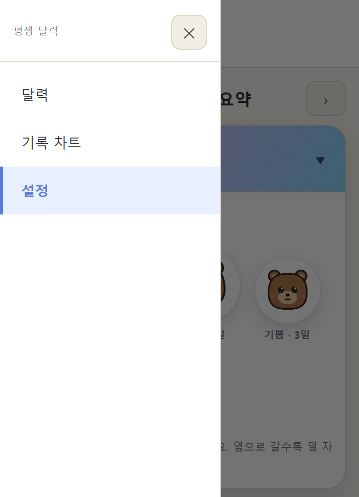

---

## 지원 / 다운로드

현재는 **Android** 베타 단계입니다.
APK 배포 일정과 다운로드 링크는 이 README 에 곧 업데이트될 예정입니다.

- 사용 중 문제, 새로운 기분 캐릭터 / 테마 제안, 혹은 단순한 후기 — 모두 환영합니다.
- 이슈 등록: [Issues 탭](https://github.com/yourboardlab/calendar_readme/issues/new) 에 자유롭게 글을 남겨 주세요.
  - 제목 한 줄과 어떤 화면에서 일어난 일인지만 적어 주시면 충분합니다.

---

## FAQ

**Q. 인터넷 연결이 끊겨도 쓸 수 있나요?**
네. 인터넷 없이 모든 기능이 동작합니다.

**Q. iOS 버전은 언제 나오나요?**
앱은 웹 기반 (Capacitor) 으로 만들어져서 기술적으로는 iOS 빌드도 가능합니다. 다만 베타 사용자 피드백을 안드로이드에서 먼저 받아 보고 결정할 예정입니다.

**Q. 데이터가 다른 기기로 옮겨지나요?**
설정에서 **내보내기 → ZIP 파일** 로 백업한 뒤, 새 기기에서 **불러오기** 로 복원하시면 됩니다. 한 ZIP 안에 월별 JSON 12개가 들어 있는 단순한 구조라, 1년 단위로도 정리하기 좋습니다.

**Q. 사용료가 있나요?**
지금은 무료 베타입니다. 앞으로도 광고는 넣지 않을 계획입니다.

---

## 라이선스 / 저작권

- 앱 자체의 코드 라이선스는 별도 비공개 저장소에서 관리됩니다.
- 이 저장소(`calendar_readme`)의 텍스트와 스크린샷은 © 2026 yourboardlab. All rights reserved.
- 사용된 캐릭터 자산은 [Kawaii Emoticons](https://github.com/) 컬렉션 기반의 PNG/GIF 입니다.

---

  <em>오늘을 가볍게 남기는 습관이, 어느 날 가장 따뜻한 기록이 됩니다.</em>

