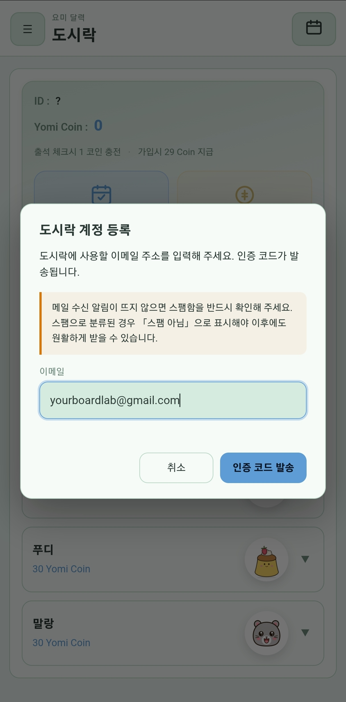
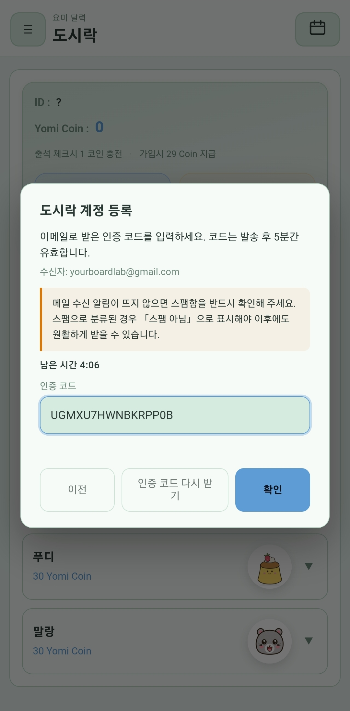
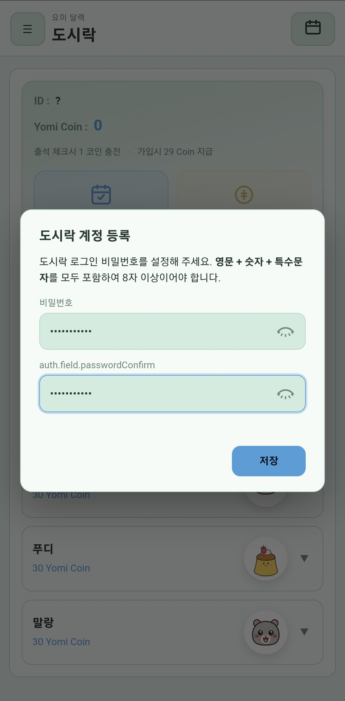
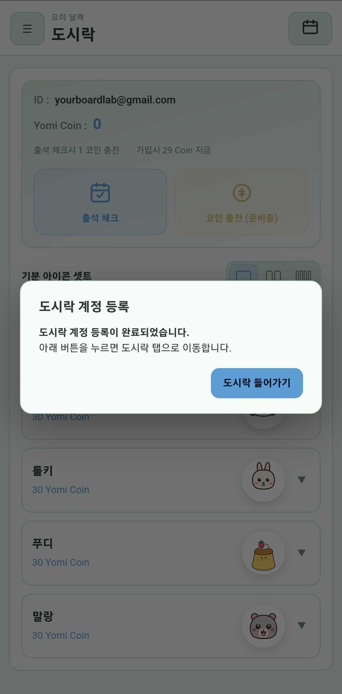
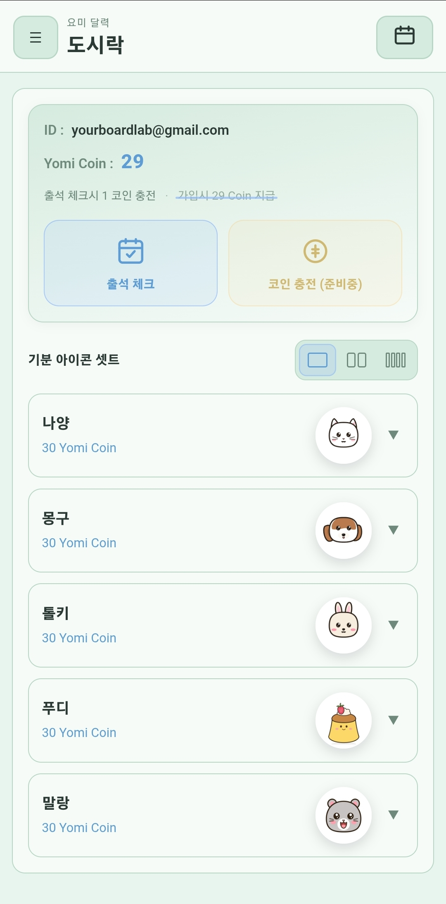
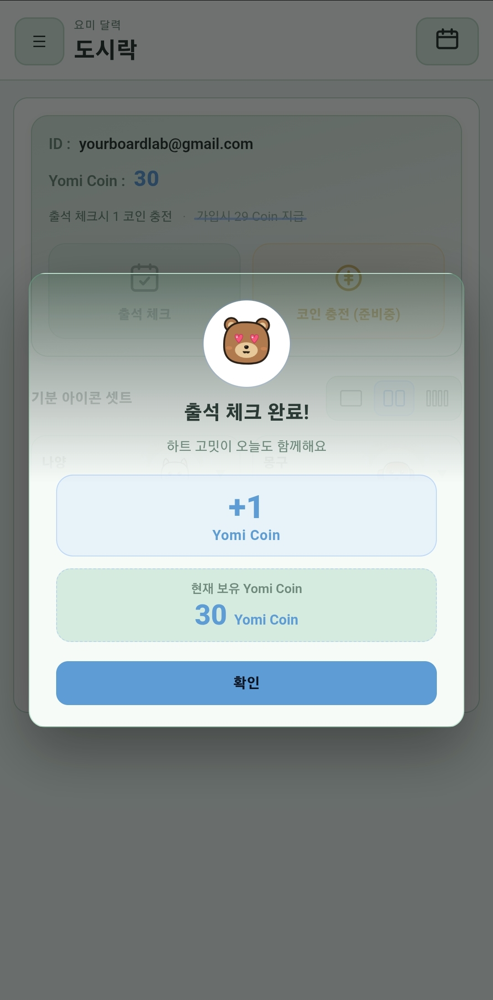
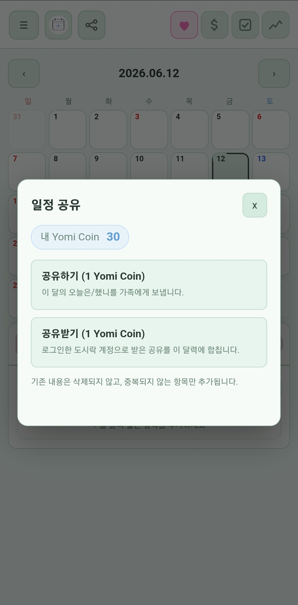
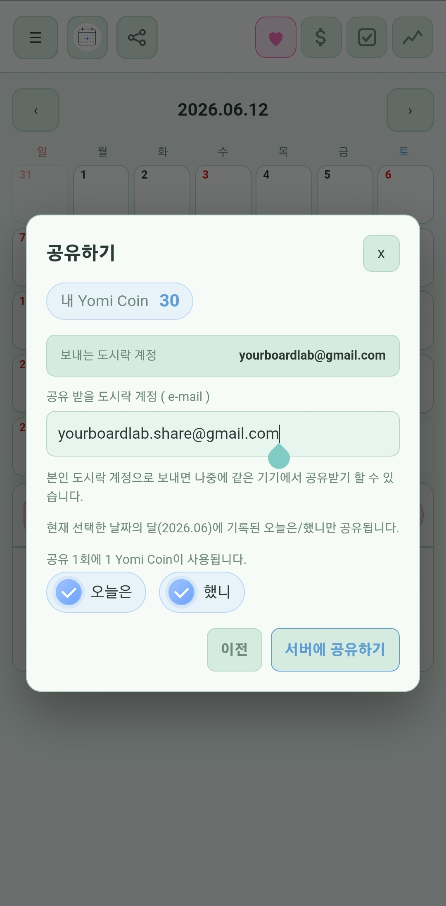
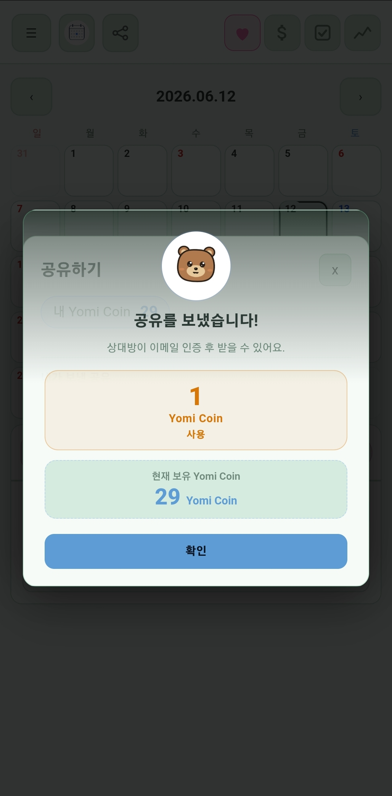
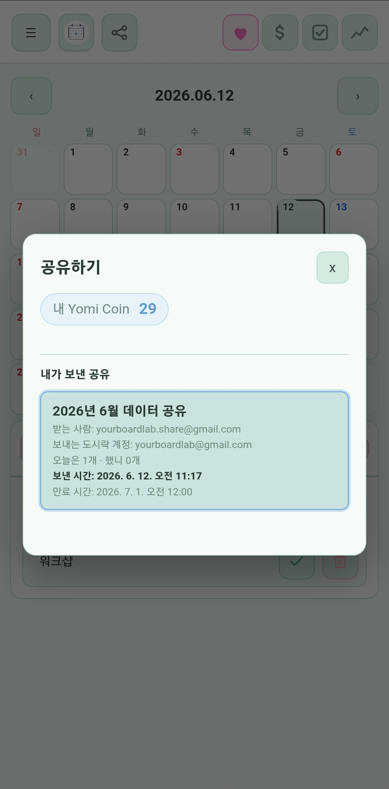

# 요미 달력 · Yomi Calendar

> *A tiny calendar to capture your today — memos, money, todos, scores, and moods, all in one tap.*

<strong><a href="#요미-달력--yomi-calendar">한국어</a> · <a href="#english">English</a></strong>

매일의 작은 순간을 부담 없이 남기고, 한 달이 모이면 내 기분과 습관이 한눈에 보이는 캘린더 앱입니다.
기본은 **계정 없이** 쓰며, 기록은 **내 휴대폰 안에만** 저장됩니다. **도시락** 기능으로 Yomi Coin 계정을 만들어 일정을 소중한 사람과 **공유**하거나 캐릭터 이모티콘 셋을 구매할 수 있고, 원하면 설정에서 **로그인(이메일·비밀번호)** 을 켜 앱 실행 시 잠금을 걸 수 있습니다.

스토어·런처·위젯 목록에는 **요미 달력**, **Yomi Calendar**, 또는 빌드 설정에 따른 영문 표기가 함께 쓰일 수 있습니다. 이 문서에서는 제품을 **요미 달력**으로 통칭합니다.

  

### 소개 영상

30초짜리 앱 소개 영상은 YouTube에서 볼 수 있습니다.

▶ **[요미 달력 소개 영상 보기](https://youtu.be/QZBNNUx_LD0)**

---

## 왜 만들었나요?

일정만 등록해 두고, 알림용으로 **전락한 달력 앱**에 생기를 불어 넣고 싶었습니다.

하루에 가장 중요한 것은, 그날의 **내 기분**이 아닐까 생각해 봤습니다. 앱을 켜고 **귀여운 캐릭터**로 오늘의 내 기분을 표현할 수 있으면 좋겠다고 생각했습니다.

하루 동안 하는 일이라곤 — 돈 쓰는 일, 숙제나 과제, 프로젝트 같은 **했어야 하는 일**들로 가득 차 있었습니다. 나름 운동을 하는 분들은 그에 맞는 **스코어**도 등록하리라 예상했습니다. 기록하고 싶은 부수적인 것들은, 이 정도면 **하루의 나**를 다 표현할 수 있으리라 생각했습니다.

그냥, 그래서 만들었습니다.

혹시나 누가 볼까 봐, 앱에 **비밀번호**도 설정할 수 있게 해 두었으니, 숨기고 싶은 내용도 마음껏 쓰셔도 됩니다.

이 앱에서 가장 좋은 점은 **광고도, 가입도 없다**는 것입니다. 당신의 휴대폰 안에만 **안전하게 암호화**되어 있으니, 안심하셔도 됩니다. 공유하고 싶을 때만 **도시락** 기능으로 소중한 사람과 오늘을 나눌 수 있습니다.

**이 정도면, 이 앱을 만든 이유는 충분한가요?**

---

## 핵심 기능

### 1. 오늘은 — 하루 한 줄 메모

항목당 **최대 10자**까지 짧게 끊어 오늘을 기록합니다. "회의", "저녁 약속", "야근" 같은 식으로요.
긴 일기가 부담스러운 분에게 가장 잘 맞는 입력 방식입니다.

설정에서 **「달력에 오늘은 일정 표시」** 를 켜면, 오늘은에 항목이 있는 날은 달력 칸 가운데에 **기분 캐릭터 대신 일정을 최대 3줄** 미리 볼 수 있습니다. 기본값은 **꺼짐**입니다.

  

  
  &nbsp;
  

<em>왼쪽: 설정 토글 · 오른쪽: 달력 칸에 표시된 오늘은 텍스트 (최대 3줄)</em>

### 2. 썼니 — 가벼운 가계부

오늘 쓴 돈을 한 줄씩 적어 두기만 하면 끝. 항목 이름과 금액 두 필드뿐이라 30초면 끝납니다.
달력 셀 마커에는 **파란 $** 아이콘으로 표시됩니다.

  

### 3. 했니 — 하루 체크리스트

오늘 해야 할 일, 또는 매일 반복하는 습관을 체크박스로. 채울 때마다 작은 성취감이 따라옵니다.

  

### 4. 기록 — 무엇이든 숫자로

체중, 운동 횟수, 수면 시간, 공부 시간 — 숫자로 남기고 싶은 건 무엇이든. 같은 항목을 매일 입력하면 추세 그래프가 같이 그려집니다.

  

### 5. 기분 — 캐릭터로 표현하는 오늘의 마음

곰 / 고양이 / 강아지 / 토끼 네 가지 캐릭터 중 하나를 고르고, 각 8가지 표정 (행복 / 슬픔 / 화남 / 사랑 / 놀람 / 졸림 / 웃음 / 부끄러움) 으로 그날의 기분을 남깁니다.

  
  &nbsp;
  

#### 이 달의 기분 배지

이번 달에 가장 많이 선택한 기분이, 달력 상단 **년·월·일** 왼쪽·오른쪽에 **GIF 배지**로 살아 움직입니다.
좌측(큰 배지)은 **1위(가장 많이 기록한 기분)** 이고, **등록 횟수가 같으면 가장 최근에 남긴 기분**이 왼쪽에 크게 표시됩니다.
우측(작은 배지)은 2위 기분입니다. 한 가지 기분만 있으면 좌·우에 같은 캐릭터가 보이고, 한 개도 없는 달은 배지가 숨겨집니다.

  

#### 한 셀에 하루를 다 보여주는 4 모서리 인디케이터

각 날짜 셀의 **네 모서리**에 그날 무엇을 기록했는지 작은 컬러 아이콘으로 표시됩니다.
실제로 글자가 한 줄이라도 적혀 있을 때만 아이콘이 켜지고, 빈 카테고리는 칸이 비워집니다.

| 위치 | 카테고리 | 색 |
|------|----------|------|
| 좌상단 | 오늘은(메모) | 핑크 하트 |
| 우상단 | 썼니(가계부) | 파란 **$** |
| 좌하단 | 했니(체크리스트) | 초록 체크 |
| 우하단 | 기록(숫자 모음) | 보라 꺾은선 |
| 가운데 | 그날의 **기분**(기본) 또는 **오늘은 일정**(설정 ON·항목 있을 때, 최대 3줄) | 캐릭터 PNG / 짧은 텍스트 |

  

### 6. 기록 차트 (월별 요약)

한 달 치 **기분 · 썼니 · 했니 · 기록(숫자)** 를 한 화면에서 볼 수 있는 통계 탭입니다.
접었다 펼 수 있는 카드 형식으로, 기분은 상위 3개 이모티콘 GIF 크기로 한 달 요약을 보여 주고 (1·2·3위 순서대로 점점 작아지는 podium 형태), 썼니/했니는 0을 기준으로 위·아래 막대 + 누적 꺾은선, 기록(숫자)은 항목별 꺾은선으로 표시됩니다. 각 차트 **좌측에는 최고/중간/0/최저 수치가 작게 표시**되어 한눈에 규모를 가늠할 수 있습니다.

  

  

### 7. 홈 화면 위젯 (Android)

안드로이드 **홈 화면**에 **2×2 위젯**을 추가할 수 있습니다. 위젯 목록에서 앱 이름(**요미 달력**, **Yomi Calendar** 등, 기기·스토어·언어에 따라 표시가 다를 수 있음)으로 항목을 찾아 바탕화면에 놓으면 됩니다.

- **내용**: **오늘의 날짜 숫자(일)** 와, 앱에서 마지막으로 맞춰 둔 **기분 캐릭터** 이미지가 보입니다.
- **Android 12 (API 31) 이상**: 위젯 안에서 기분 **GIF**가 움직이도록 표시됩니다.
- **Android 11 이하**: 홈 위젯에서 GIF 애니메이션을 안정적으로 쓰기 어려운 제약이 있어, **정적인 베어 아이콘**으로 대신 표시됩니다.
- **탭**: 위젯을 누르면 앱이 열립니다. 기분을 바꾼 뒤에는 잠시 후 위젯이 다시 그려지며, 바로 반영이 안 보이면 위젯을 한 번 제거했다가 다시 추가해 보세요.

> 위젯은 **오프라인**에서도 동작하며, 인터넷 연결 없이 휴대폰에 저장된 기분 설정을 읽습니다.

### 8. 로그인 (선택)

**앱을 나만 보고 싶을 때 쓰는 비밀번호 잠금 기능**입니다. (클라우드 **회원 가입이 아닙니다.**) 달력·메모·가계부 내용과 비밀번호 **평문은 어디로도 보내지 않으며**, 비밀번호는 기기 안에 **단방향 해시(PBKDF2-SHA256, 10만 회)** 로만 저장됩니다. 최초 설정·재설정 때에만 **본인 이메일로 인증 코드**가 잠깐 발송됩니다(코드 자체는 서버에 저장하지 않음).

휴대폰을 분실해 저장소에서 **해시만** 빼낸 뒤 무차별 대입한다고 가정할 때의 **대략적인 체감**(비밀번호 종류·도난자 장비에 따라 크게 달라짐):

| 도난자가 쓰는 장비 (오프라인 대입) | 비밀번호 예시 | 대략 걸리는 시간 (순서) |
|----------------------------------|---------------|-------------------------|
| **중급 PC** (6코어급 CPU 또는 일반 GPU) | 정책을 지킨 10~12자, 추측하기 어려운 조합 | **수년 ~ 수십 년 이상** |
| 같은 PC | 8자, 흔한 단어·생일 등 | **며칠 ~ 수개월** |
| **최신 스마트폰만** (PC 없이) | 위와 동일 | PC보다 보통 **수십 배 느림** → 시간 더 김 |

→ **강한 비밀번호**를 쓸수록 분실·도난 후에도 안전 마진이 커집니다. 완전한 보장은 없습니다.

설정 맨 아래 **「로그인 기능 사용」** 을 켜면:

- **설정:** 이메일 입력 → **이메일로 받은 인증 코드** 입력(**발송 후 5분** 유효) → 비밀번호 등록(영문·숫자·특수문자, **8자 이상**)
- **실행 시:** 등록한 이메일·비밀번호로 잠금 해제 후 달력 사용
- **비밀번호 재설정:** 로그인 화면에서 기존 비밀번호 폐기 후, 같은 이메일로 인증·새 비밀번호 등록
- **비밀번호 표시:** 입력 칸 옆 **눈 아이콘**으로 보기/숨기기
- **저장:** 비밀번호는 기기 안에 **암호화된 해시**로만 남고, 평문은 저장되지 않습니다

인증 메일 발송에만 [Vercel `dailylog` 프로젝트](https://vercel.com/yourboardlab-s-projects/dailylog) API를 씁니다. **일기·가계부 본문은 전송하지 않습니다.**

  
  &nbsp;
  

  
  &nbsp;
  

  

### 9. 도시락 — Yomi Coin 계정

**도시락**은 일정 공유와 이모티콘 셋 구매를 위한 **Yomi Coin 기반 계정 시스템**입니다. 기본 기능(달력·메모·가계부·체크·기분)은 계정 없이도 그대로 쓸 수 있으며, 공유가 필요할 때만 계정을 만들면 됩니다.

#### 계정 등록

1. **이메일 입력** — 인증 코드를 받을 이메일 주소를 입력합니다.
2. **인증 코드 확인** — 발송된 코드를 5분 이내에 입력합니다.
3. **비밀번호 설정** — 영문 + 숫자 + 특수문자를 모두 포함, **8자 이상**이어야 합니다.
4. **등록 완료** — 도시락 탭으로 이동하면 **29 Yomi Coin**이 자동 지급됩니다.

  
  &nbsp;
  

  
  &nbsp;
  

#### 도시락 메인 화면

등록 후 도시락 화면에서 계정 정보와 Yomi Coin을 관리할 수 있습니다.

- **ID**: 가입한 이메일 주소
- **Yomi Coin 잔액**: 현재 보유 코인 수
- **출석 체크**: 하루 1회, 체크할 때마다 **+1 Yomi Coin** 적립
- **코인 총전** *(준비 중)*: 현금으로 코인을 충전하는 기능, 출시 예정
- **기분 아이콘 셋**: 나양 / 몽구 / 틀키 / 푸디 / 말랑 (각 **30 Yomi Coin**)

  
  &nbsp;
  

<em>왼쪽: 도시락 메인 화면 · 오른쪽: 출석 체크 완료 (+1 코인)</em>

#### Yomi Coin

| 항목 | 내용 |
|------|------|
| 가입 보너스 | **+29 코인** (1회) |
| 출석 체크 | **+1 코인** / 일 |
| 일정 공유 | **−1 코인** / 공유 1건 |
| 이모티콘 셋 구매 | **−30 코인** / 셋 1종 |
| 코인 충전 (현금) | *(준비 중)* |

### 10. 일정 공유

도시락 계정이 있으면, 선택한 달의 **오늘은** · **했니** 항목을 상대방의 도시락 계정(이메일)으로 보낼 수 있습니다.

- **공유 비용**: 1회당 **1 Yomi Coin** 소모
- **공유 항목 선택**: 오늘은 / 했니 카테고리를 개별 선택 가능
- **수신**: 상대방 계정에 해당 월 항목이 추가 (기존 데이터 삭제 없음)
- **만료**: 해당 월 말일 자정 기준
- **공유 이력**: 보낸 내역과 만료일을 도시락 화면에서 확인 가능
- 일기·가계부·기분 등 **개인 기록은 공유에 포함되지 않습니다**

  
  &nbsp;
  

  
  &nbsp;
  

<em>왼쪽 위: 공유 시작 · 오른쪽 위: 수신자·항목 설정 · 왼쪽 아래: 공유 완료 · 오른쪽 아래: 공유 이력</em>

---

## 가로 모드 (Landscape)

휴대폰을 옆으로 돌리면 더 많은 정보가 한 화면에 들어옵니다.
**달력 화면**은 좌측 캘린더 + 우측 카드 2단으로, **기록 차트**는 4개 카드가 **2×2 격자**로 펼쳐집니다.

  

### 회전 동작 설정

설정의 **「화면 회전 허용」** 토글로 동작을 고를 수 있습니다.

| 토글 | 동작 |
|------|------|
| **OFF (기본)** | 휴대폰을 돌려도 **항상 세로 모드** 유지 |
| **ON** | 휴대폰 회전 따라 **세로 ↔ 가로 자동 전환** |

안드로이드(Capacitor) 빌드에서는 **Activity 방향**과 웹 화면 설정을 같이 맞춥니다. 일부 WebView에서 브라우저 회전 API가 무시되더라도, 회전을 끈 상태에서는 가로 전용 레이아웃이 잘못 켜지지 않도록 보완되어 있습니다.

---

## 색상 테마

다크 모드와 라이트 모드 사이의 어딘가 — **파스텔 톤 8가지**.
midnight / paper / mint / peach / lavender / sky / rose / sand 중에서 그날의 기분에 맞게 골라 보세요.

> 이 페이지의 스크린샷은 모두 **paper(라이트)** 톤으로 캡처되었습니다.

  

---

## 다국어 지원 (Languages)

기본은 한국어이지만 설정의 **언어** 콤보박스에서 다음 언어로 한 번에 전환할 수 있습니다.
콤보박스의 옵션 라벨은 각 언어의 **자국어 표기**로 표시되어, 다른 나라 언어를 잘 모르더라도 자기 모국어를 한눈에 찾을 수 있습니다.

영어는 **미국·영국 공휴일**을 각각 쓰도록 두 가지로 나뉩니다. 화면 문구는 동일한 영어 사전을 쓰고, **달력에 쓰이는 공휴일 목록만** US / GB 로 갈립니다.

| 언어 | 콤보박스 표시 | 카드 4종 |
|------|----------------|----------|
| 한국어 (기본) | 한국어 | 오늘은 / 썼니 / 했니 / 기록 |
| English (American) | English (American) | Today / Spent? / Done? / Stats |
| English (British) | English (British) | Today / Spent? / Done? / Stats |
| 中文 | 中文 | 今天 / 花了？ / 做了？ / 记录 |
| 日本語 | 日本語 | 今日は / 使った？ / やった？ / 記録 |
| Tagalog | Tagalog | Ngayon / Gastos? / Tapos na? / Tala |
| Tiếng Việt | Tiếng Việt | Hôm nay / Tiêu? / Xong chưa? / Số liệu |
| Русский | Русский | Сегодня / Потратил? / Сделал? / Записи |
| Español | Español | Hoy / ¿Gasté? / ¿Hecho? / Registros |
| Deutsch | Deutsch | Heute / Ausgegeben? / Erledigt? / Werte |
| Français | Français | Aujourd'hui / Dépensé ? / Fait ? / Suivi |

> "오늘은"·"기록"은 일상어 그대로 옮겼고, **"썼니"·"했니"의 짧고 캐주얼한 어감**은 각 언어에서도 짧은 의문형으로 살렸습니다 (Spent? / Done?, 使った？ / やった？ 등).

### 달력: 요일 색과 국가별 공휴일

- **일요일** 날짜 숫자는 **붉은색**, **토요일**은 **파란색**으로 표시합니다.
- **공휴일**이 있는 날은 날짜 숫자도 **붉은색**으로 강조합니다. 셀 **맨 아래**에는 해당 국가 API가 내려주는 **현지 이름**을 짧게 붙입니다.
- 공휴일 목록은 [Nager.Date](https://date.nager.at) 공개 API(연도·국가 코드 단위)를 사용합니다. **해당 연도·국가를 처음 볼 때** 한 번 네트워크로 받아 오며, 이후에는 기기에 **캐시**되어 같은 달을 다시 열 때는 끊긴 상태에서도 표시됩니다.

**언어(콤보박스) → 공휴일 기준 국가**

| 언어(콤보박스) | 공휴일 API 국가 코드 |
|----------------|----------------------|
| 한국어 | KR |
| English (American) | US |
| English (British) | GB |
| 中文 | CN |
| 日本語 | JP |
| Tagalog | PH |
| Tiếng Việt | VN |
| Русский | RU |
| Español | ES |
| Deutsch | DE |
| Français | FR |

---

## 데이터는 어디 저장되나요?

- **달력·메모·가계부·기분 등 기록은 전부 휴대폰 안에만** 저장됩니다. 일기 본문은 서버로 보내지 않습니다.
- **일정 공유·도시락** 기능을 사용할 때만 선택한 일정 항목이 서버를 경유합니다. 일기·가계부 본문은 공유되지 않습니다.
- **로그인은 선택**입니다. 켠 경우 이메일·**암호화된 비밀번호 해시**·마지막 로그인 이메일만 기기에 남습니다. 클라우드 회원가입·광고 추적은 없습니다.
- 백업이 필요할 땐 **설정 → 내보내기** 로 기록을 **하나의 ZIP 파일**로 저장할 수 있고, **불러오기** 로 새 기기에서 그대로 복원할 수 있습니다.

  

---

## FAQ

**Q. 도시락과 일정 공유는 무엇인가요?**  
**도시락**은 Yomi Coin 기반 계정 시스템으로, 일정 공유와 이모티콘 셋 구매가 가능합니다. **일정 공유**는 도시락 계정을 통해 선택한 달의 오늘은·했니 항목을 상대방 도시락 이메일로 전달하는 기능입니다. 일기·가계부·기분은 절대 포함되지 않습니다.

**Q. 공유를 사용하면 내 기록이 서버에 저장되나요?**  
공유 기능을 사용할 때 선택한 일정 항목만 서버를 경유합니다. 공유하지 않은 기록은 기기 밖으로 나가지 않으며, 가계부·일기·기분 등 개인 기록은 공유 대상이 아닙니다.

**Q. 인터넷 연결이 끊겨도 쓸 수 있나요?**  
네. 메모·가계부·체크·기록·기분·위젯 등 **핵심 기능은 오프라인**에서 동작합니다. 국가별 공휴일 이름은 처음 볼 때만 네트워크가 필요하고, 이후에는 기기 캐시로 표시됩니다. 일정 공유와 도시락 기능은 인터넷 연결이 필요합니다.

**Q. iOS 버전은 언제 나오나요?**  
현재까지는 계획이 없습니다. iOS 버전 개발에는 추가 비용이 발생합니다. 필요하신 분은 이메일로 문의해 주세요.

**Q. 데이터가 다른 기기로 옮겨지나요?**  
설정에서 **데이터보내기 → ZIP** 으로 백업한 뒤, 새 기기에서 **데이터 불러오기**로 복원하세요. ZIP에는 설정과 로그인(해시)도 포함됩니다. 로그인을 켜 두었다면 같은 비밀번호로 바로 잠금 해제할 수 있습니다.

**Q. 로그인을 꼭 써야 하나요?**  
아니요. 기본은 로그인 없이 사용합니다. 원할 때만 설정에서 켜면 됩니다.

**Q. 인증 메일이 안 와요.**  
인터넷·스팸함·이메일 오타를 확인해 주세요. 발송은 [Vercel dailylog](https://vercel.com/yourboardlab-s-projects/dailylog) 백엔드를 쓰며, 과도한 요청 시 일시 제한될 수 있습니다.

**Q. 사용료가 있나요?**  
광고 없는 무료 앱입니다. Yomi Coin을 사용하는 일부 기능(일정 공유, 이모티콘 셋)은 코인이 필요하며, 매일 출석 체크로 무료 적립할 수 있습니다.

**Q. 홈 화면 위젯은 어떻게 쓰나요?**  
안드로이드에서 바탕화면을 길게 누른 뒤 **위젯**을 선택하고, 목록에서 이 앱의 위젯을 찾아 추가하면 됩니다. Android 12 이상에서는 기분 GIF가, 그보다 낮은 버전에서는 정적 아이콘이 보입니다.

**Q. 새로운 기능을 추가해 주실 수 있나요?**  
추가 기능 개발은 개발비용이 발생합니다. 이메일로 문의해 주세요.

---

## English {#english}

# Yomi Calendar · 요미 달력

> *A tiny calendar to capture your today — memos, money, todos, scores, and moods, all in one tap.*

<strong><a href="#요미-달력--yomi-calendar">한국어</a> · <a href="#english">English</a></strong>

Yomi Calendar helps you log small daily moments without pressure. When a month fills up, your moods and habits become visible at a glance.
By default there is **no account** — everything stays **on your phone only**. Use **Bento (도시락)** to create a Yomi Coin account, share selected schedule items with someone close, or purchase character emoticon sets. Optionally enable **sign-in (email + password)** in Settings to lock the app on launch.

The app may appear as **요미 달력**, **Yomi Calendar**, or another localized name in the store, launcher, and widget picker.

### Why Yomi Calendar?

I wanted to breathe life back into calendar apps that had become little more than **schedules and notification reminders**.

What matters most in a day, I thought, is **how you felt**. I wanted you to open the app and express today's mood with **cute characters**.

A day is also full of the things you actually do — spending money, homework and assignments, projects you need to finish. People who exercise might log scores that fit their routine. I figured that much — on top of mood — was enough to capture **who you were that day**.

So I built it. That's really the reason.

If you're worried someone might peek, you can set an **app password** and write what you'd rather keep private.

The best parts, to me: **no ads, no sign-up**. Everything stays **encrypted on your phone** — you can use it with peace of mind. And when you want to share, **Bento** lets you pack your day for someone close.

**Is that enough of a reason this app exists?**

---

### Features

#### 1. Today — one-liner daily memo

Log up to **10 characters** per item. "Meeting", "dinner out", "worked late" — small entries for people who find full diary entries too much pressure.

Turn on **Settings → 「Show Today items on calendar」** to preview up to **3 short Today lines** in the center of any day cell that has entries — instead of the mood character. **Off by default.**

  

  
  &nbsp;
  

<em>Left: Settings toggle · Right: Today lines on the calendar (up to 3)</em>

#### 2. Spent? — lightweight ledger

One line per expense: name and amount. Thirty seconds and you're done.
A **blue $** marker appears on calendar cells where you logged spending.

  

#### 3. Done? — daily checklist

Tasks you need to finish today, or daily habits. Each check is a small win.

  

#### 4. Stats — anything in numbers

Weight, reps, sleep, study time — any number you want to track. Same item every day builds a trend graph automatically.

  

#### 5. Mood — characters for how you feel

Choose from bear / cat / dog / rabbit, each with 8 expressions (happy / sad / angry / love / surprised / sleepy / laughing / shy) to capture the mood of the day.

  
  &nbsp;
  

##### This month's mood badges

Animated **GIF badges** at the top of the calendar show your top moods for the month.
The **large left badge** is **#1 (most logged)**. If counts are **tied**, the **most recently logged mood** wins on the left.
The **small right badge** is **#2**. One mood only → same character on both sides; none logged → badges hidden.

  

##### Four-corner cell indicators

Each day cell shows a tiny colour icon in each corner for what you recorded — only when at least one entry exists.

| Position | Category | Colour |
|----------|----------|--------|
| Top-left | Today (memos) | Pink heart |
| Top-right | Spent? (ledger) | Blue **$** |
| Bottom-left | Done? (checklist) | Green check |
| Bottom-right | Stats (numeric) | Purple line |
| Centre | **Mood** (default) or **Today text** (Settings ON, up to 3 lines) | Character / text |

  

#### 6. Monthly charts

One-screen summary of your month: mood podium (top 3 GIF characters by count), Spent? bar + cumulative line, Done? bar chart, and Stats line charts per item. Each chart shows min/mid/zero/max labels on the left.

  

#### 7. Home-screen widget (Android)

Add a **2×2 widget** from the widget picker. Find the app (**요미 달력**, **Yomi Calendar**, etc.) and place it on your launcher.

- **Shows:** today's **day-of-month number** and the **mood character** you last set.
- **Android 12+ (API 31):** mood **GIF** animates in the widget.
- **Android 11 and below:** static **bear icon** (GIF in home widgets is unreliable on older versions).
- **Tap:** opens the app. Remove and re-add if it looks stale after changing mood.

> Works **offline**; reads mood settings stored on the device.

#### 8. Sign-in (optional)

An **optional app lock** — **not** a cloud account. Your calendar entries and password **plaintext never leave the device**; the password is stored on-device as an **encrypted hash (PBKDF2-SHA256, 100,000 rounds)**. A one-time verification code is emailed only when you set up or reset the lock.

If someone steals the phone and extracts only the **encrypted hash** for offline guessing (rough sense; varies by password and hardware):

| Attacker hardware (offline) | Example password | Rough time (order of magnitude) |
|-----------------------------|------------------|----------------------------------|
| **Mid-range PC** (6-core CPU or consumer GPU) | Strong 10–12 chars, hard to guess | **Years to decades+** |
| Same PC | 8 chars, common words/birthdays | **Days to months** |
| **Phone only** (no PC) | Same as above | Often **~10× slower** than a PC → longer |

Stronger passwords improve safety after loss or theft; there is no absolute guarantee.

Turn on **「Use sign-in」** at the bottom of Settings:

- **Setup:** email → verification code from email (valid **5 minutes** after send) → password (letters, numbers, symbols, **8+ chars**)
- **Launch:** unlock with registered email + password
- **Reset:** discard old password on sign-in screen → verify same email → new password
- **Show password:** **eye icon** beside fields
- **Storage:** **encrypted hash only** on device; plaintext is never stored

Verification email uses the [Vercel `dailylog` project](https://vercel.com/yourboardlab-s-projects/dailylog) API only. **Diary and ledger bodies are never sent.**

  
  &nbsp;
  

  
  &nbsp;
  

  

#### 9. Bento (도시락) — Yomi Coin account

**Bento** is a **Yomi Coin account system** for schedule sharing and emoticon set purchases. All core features work without an account — create one only when you want to share.

**Registration:**

1. **Enter email** — the address to receive your verification code.
2. **Enter verification code** — valid for 5 minutes after sending.
3. **Set password** — must include letters, numbers, and symbols; **8 characters minimum**.
4. **Done** — navigate to the Bento tab; **29 Yomi Coins** are credited automatically.

  
  &nbsp;
  

  
  &nbsp;
  

**Bento main screen:**

- **ID**: your registered email
- **Yomi Coin balance**: current coin total
- **Daily check-in**: one tap per day → **+1 Yomi Coin**
- **Coin recharge** *(coming soon)*: purchase coins with real money
- **Emoticon sets**: Nayang / Monggu / Tulki / Pudi / Mallang — each **30 Yomi Coins**

  
  &nbsp;
  

<em>Left: Bento main screen · Right: Daily check-in reward (+1 coin)</em>

**Yomi Coin summary:**

| Event | Coins |
|-------|-------|
| Sign-up bonus | **+29** (one time) |
| Daily check-in | **+1** / day |
| Share schedule | **−1** / share |
| Buy emoticon set | **−30** / set |
| Coin recharge (cash) | *(coming soon)* |

#### 10. Schedule Sharing (일정 공유)

With a Bento account, share the selected month's **Today** and **Done?** items to another Bento account (by email).

- **Cost**: **1 Yomi Coin** per share
- **Choose categories**: Today / Done? can be toggled individually
- **Received**: items are added to the recipient's data for that month; nothing is deleted
- **Expiry**: end of the shared month
- **History**: view sent shares and their expiry dates from the Bento screen
- Diary, ledger, and mood data are **never** included in a share

  
  &nbsp;
  

  
  &nbsp;
  

<em>Top-left: start sharing · Top-right: recipient and categories · Bottom-left: share sent · Bottom-right: history</em>

---

### Landscape mode

Rotate your phone for more on screen: **calendar** = calendar left + cards right; **monthly charts** = **2×2** card grid.

**Allow screen rotation** in Settings.

| Toggle | Behavior |
|--------|----------|
| **OFF (default)** | Always **portrait** |
| **ON** | **Portrait ↔ landscape** follows device rotation |

### Colour themes

Eight pastel tones between dark and light:
midnight / paper / mint / peach / lavender / sky / rose / sand

### Languages

Choose your language from the **Language** combo box in Settings. Options are shown in their **native script** so you can find your own at a glance.

| Language | Card labels |
|----------|-------------|
| 한국어 (default) | 오늘은 / 썼니 / 했니 / 기록 |
| English (American) | Today / Spent? / Done? / Stats |
| English (British) | Today / Spent? / Done? / Stats |
| 中文 | 今天 / 花了？ / 做了？ / 记录 |
| 日本語 | 今日は / 使った？ / やった？ / 記録 |
| Tagalog | Ngayon / Gastos? / Tapos na? / Tala |
| Tiếng Việt | Hôm nay / Tiêu? / Xong chưa? / Số liệu |
| Русский | Сегодня / Потратил? / Сделал? / Записи |
| Español | Hoy / ¿Gasté? / ¿Hecho? / Registros |
| Deutsch | Heute / Ausgegeben? / Erledigt? / Werte |
| Français | Aujourd'hui / Dépensé ? / Fait ? / Suivi |

Language also determines the public-holiday country (KR / US / GB / CN / JP / PH / VN / RU / ES / DE / FR). Holidays are fetched once per year/country and cached on-device.

### Where is my data?

- **All entries stay on your device.** Diary text is not uploaded.
- **Schedule sharing and Bento** use the server only when you choose to share. Only the selected Today / Done? items are sent — diary, ledger, and mood bodies are never shared.
- **Sign-in is optional.** When enabled, only email, **encrypted password hash**, and last sign-in email are stored on-device. No cloud signup or ad tracking.
- **Export → ZIP** in Settings; **Import** on a new device restores everything.

### FAQ (English)

**Q. What are Bento and Schedule Sharing?**  
**Bento** is a Yomi Coin account system for schedule sharing and emoticon set purchases. **Schedule Sharing** sends selected Today and Done? items for a given month to another Bento account by email. Diary, ledger, and mood data are never included.

**Q. Does sharing send my data to a server?**  
Only the Today / Done? items you explicitly select are sent via the server when you share. Everything else stays on your device.

**Q. Does it work offline?**  
Yes — memos, ledger, checklist, stats, mood, and the widget all work offline. Public holidays need one online fetch per year/country, then cache. Schedule sharing requires an internet connection.

**Q. Move data to another phone?**  
**Export → ZIP**, then **Import** on the new device. ZIP includes settings and optional sign-in hash; use the same password to unlock if sign-in was enabled.

**Q. Must I sign in?**  
No — off by default. Enable in Settings when you want an app lock.

**Q. Verification email not arriving?**  
Check network, spam folder, and email address for typos. Sent via [Vercel dailylog](https://vercel.com/yourboardlab-s-projects/dailylog); heavy use may be rate-limited.

**Q. Is there a fee?**  
The app is free with no ads. Some features (schedule sharing, emoticon sets) require Yomi Coins, which you can earn free through daily check-ins.

**Q. Home widget?**  
Long-press the home screen → **Widgets** → add this app's widget. See **§7** above.

**Q. iOS version?**  
No plans currently. Development requires additional cost — contact us by email if interested.

---

## 개인정보처리방침 · Privacy Policy

> **Google Play 등 스토어 등록용 공개 URL**  
> `https://github.com/yourboardlab/calendar_readme#개인정보처리방침--privacy-policy`  
> **최종 업데이트:** 2026-06-12 · **앱:** 요미 달력 (Yomi Calendar) · **운영:** yourboardlab

### 한국어

**1. 개요**  
yourboardlab(이하 "개발자")이 제공하는 **요미 달력**(Yomi Calendar)은 사용자가 직접 입력한 일기·메모·가계부·체크·기록·기분 데이터를 **사용자 기기 안에만** 저장하는 앱입니다. **로그인은 선택**이며, 켠 경우에만 이메일·비밀번호 해시가 기기에 저장됩니다. **도시락** 기능으로 Yomi Coin 계정을 만들어 일정 공유 및 이모티콘 구매를 할 수 있으며, 공유 기능 사용 시에만 선택한 항목이 서버를 경유합니다. 클라우드 동기화·광고 식별자 추적은 하지 않습니다.

**2. 수집·처리하는 정보**

| 구분 | 내용 | 저장 위치 |
|------|------|-----------|
| 사용자 입력 | 메모(오늘은), 가계부(썼니), 체크(했니), 숫자 기록, 기분, 설정(테마·언어·회전 등) | 기기 내부 저장소만 |
| 일정 공유·도시락(선택) | 사용자가 직접 선택해 공유한 **오늘은·했니 항목** | 공유 서버 (수신자 확인 후 처리) |
| 도시락 계정(선택) | 이메일, 비밀번호 **해시**, Yomi Coin 잔액, 이모티콘 구매 이력 | 기기 및 도시락 서버 |
| 로그인(선택) | 이메일, 비밀번호 **해시**, 마지막 로그인 이메일 | 기기 내부 저장소만 |
| 인증 메일 | 로그인·도시락 가입·재설정 시 **이메일 주소·인증 코드·서명** | Vercel `dailylog` → SMTP (본문은 사용자 메일함만) |
| 백업 파일 | 설정에서 **데이터보내기** 시 사용자가 만든 ZIP | 사용자가 선택한 위치(파일 앱 등) |
| 공휴일 조회 | 설정 언어에 대응하는 **국가 코드**와 **연도** | 공휴일 API 요청 시에만 전송 |
| 위젯 표시 | 오늘 날짜·기분·오늘은·체크 요약 등 앱과 동기화한 최소 정보 | 기기 내부(Android 위젯용 설정) |

개발자는 이름, 이메일(도시락/로그인 제외), 전화번호, 위치, 연락처, 사진 등을 앱 안에서 수집하지 않습니다.

**3. 제3자 서비스**  
- **일정 공유·도시락 서버:** 사용자가 선택한 일정 항목을 상대방에게 전달하기 위해 [Vercel `dailylog`](https://vercel.com/yourboardlab-s-projects/dailylog) 서버를 사용합니다. 일기·가계부·체크·기분 본문은 전송하지 않으며, 공유 기능을 사용하지 않을 경우 서버 통신은 발생하지 않습니다.
- **공휴일 API:** [Nager.Date](https://date.nager.at) 공개 API를 사용합니다. **연도·국가 코드** 수준의 요청만 이루어집니다. 사용자가 작성한 메모 본문 등은 전송하지 않습니다.
- 응답은 기기에 **캐시**되어, 이후 같은 연·월을 볼 때 네트워크 없이도 표시될 수 있습니다.

**4. 이용 목적**  
앱 기능 제공(달력 표시, 기록·차트, 홈 화면 위젯, 알람 알림 등), 사용자 설정 반영(언어, 테마, 기분 캐릭터 등), 사용자가 요청한 보내기·불러오기.

**5. 보관 기간**  
앱 데이터는 사용자가 삭제·앱 제거·데이터 초기화할 때까지 기기에 보관됩니다. 공휴일 캐시는 기기 내부에 일정 기간 보관 후 갱신될 수 있습니다.

**6. 제3자 제공·판매**  
개발자는 사용자 데이터를 **판매하거나**, 광고 목적으로 **제3자와 공유하지 않습니다.**

**7. 권한 (Android)**

| 권한 | 용도 |
|------|------|
| 인터넷 | 공휴일 API 조회, 일정 공유, 인증 메일 발송 |
| 부팅 완료 수신 | 홈 화면 위젯 날짜 갱신 |
| 정확한 알람 | 사용자가 설정한 **알람** 알림 예약 |

**8. 아동**  
앱은 만 13세 미만을 대상으로 설계되지 않았으며, 개발자는 아동의 개인정보를 고의로 수집하지 않습니다.

**9. 국제 이전**  
사용자 입력 데이터는 사용자 기기에만 남습니다. 공휴일 API·공유 서버는 해외에 서버가 있을 수 있습니다.

**10. 이용자 권리**  
- 앱 **설정 → 보내기**로 데이터를 ZIP으로 받을 수 있습니다.
- **불러오기**·앱 삭제·기기 초기화로 데이터를 지울 수 있습니다.
- 문의: **yourboardlab@gmail.com**

**11. 정책 변경**  
중요한 변경 시 이 README를 갱신하고, 필요한 경우 앱 또는 스토어를 통해 안내할 수 있습니다.

---

### English

**1. Overview**  
**Yomi Calendar** (요미 달력), operated by **yourboardlab** ("we", "developer"), stores the records you enter — memos, ledger lines, checklists, numeric logs, and moods — **on your device only**. **Sign-in is optional**; when enabled, only your email and **encrypted password hash** stay on the device. Use **Bento (도시락)** to create a Yomi Coin account for schedule sharing and emoticon purchases; only the items you explicitly share pass through our server. We do not offer cloud sync or ad tracking.

**2. Information we process**

| Type | Examples | Where it stays |
|------|----------|----------------|
| Your entries | Memos, expenses, checklists, scores, moods, app settings | On-device storage only |
| Schedule sharing / Bento (optional) | **Today + Done?** items you select and share | Sharing server (processed on delivery) |
| Bento account (optional) | Email, password **hash**, Yomi Coin balance, emoticon purchase history | Device + Bento server |
| Sign-in (optional) | Email, **encrypted password hash**, last sign-in email | On-device storage only |
| Verification email | Email address, verification code, signature when setting up or resetting | Vercel `dailylog` → SMTP (to your mailbox only) |
| Backup ZIP | ZIP created when you tap **Export** in Settings | Where you save the file |
| Public holidays | **Country code** and **year** derived from your language setting | Sent only when calling the holiday API |
| Home widget | Today's date, mood, short memo/checklist summaries synced from the app | On-device (Android widget preferences) |

We do **not** collect your name, phone number, contacts, photos, or precise location inside the app. Email is only processed when you optionally enable sign-in or Bento.

**3. Third-party services**  
- **Schedule sharing / Bento server:** When you choose to share, selected Today + Done? items are sent via the [Vercel `dailylog`](https://vercel.com/yourboardlab-s-projects/dailylog) server to reach the recipient. Diary, ledger, and mood bodies are never included. If you don't use sharing features, no server communication occurs.
- **Holiday API:** We use the public [Nager.Date](https://date.nager.at) API. Requests include **year and country code** only — not the text of your entries.
- Responses may be **cached on your device** for offline reuse.

**4. Purposes**  
Provide app features (calendar, charts, home-screen widget, alarm notifications), apply your preferences (language, theme, mood character, etc.), and support import/export when you choose.

**5. Retention**  
App data remains on your device until you delete it, clear app data, or uninstall. Holiday cache may expire and refresh over time.

**6. Sharing / sale**  
We **do not sell** your data or share it with third parties for advertising.

**7. Android permissions**

| Permission | Purpose |
|------------|---------|
| Internet | Public holidays, schedule sharing, verification emails |
| Receive boot completed | Refresh the home-screen widget date |
| Schedule exact alarms | Deliver **alarms** you set in the app |

**8. Children**  
The app is not directed at children under 13, and we do not knowingly collect their personal information.

**9. International transfers**  
Your entries stay on your device. Holiday API and sharing server requests may reach servers operated outside your country.

**10. Your choices**  
- **Export** your data as a ZIP from Settings.
- **Import**, uninstall, or reset the app to remove data.
- Contact: **yourboardlab@gmail.com**

**11. Changes**  
We may update this policy by revising this README and, when appropriate, notifying users via the app or store listing.

---

## 코인 충전 (준비 중)

현재 Yomi Coin은 **출석 체크**(하루 +1코인)와 **가입 보너스**(+29코인)로 무료 적립되며, 이 코인으로 일정 공유(1코인/건)나 이모티콘 셋(30코인/셋)을 이용할 수 있습니다. 향후 현금으로 코인을 충전하는 기능이 추가될 예정입니다.

> 광고 없이 앱을 지속적으로 개선하기 위한 방향으로, 무료 핵심 기능(달력·메모·가계부·체크·기분)은 계속 무료로 유지됩니다.

## Coin Recharge (coming soon)

Yomi Coins are currently earned free via **daily check-in** (+1/day) and **sign-up bonus** (+29 once). Use coins for schedule sharing (1 coin each) or emoticon sets (30 coins each). A paid top-up option will be added in a future update.

> Core features (calendar, memos, ledger, checklists, mood) remain free. Coins support continued development without ads.

---

## 지원 / 문의

- 사용 중 문제, 새로운 기분 캐릭터 / 테마 제안, 혹은 단순한 후기 — 모두 환영합니다.
- 이슈 등록: [Issues 탭](https://github.com/yourboardlab/calendar_readme/issues/new) 에 자유롭게 글을 남겨 주세요.
- 비지니스 및 문의 사항: **yourboardlab@gmail.com**
- 홈페이지: [yourboardlab.github.io](https://yourboardlab.github.io/)
- 소개 영상: [YouTube — 요미 달력 소개](https://youtu.be/QZBNNUx_LD0)
- 개인정보처리방침: [이 README의 개인정보처리방침 섹션](https://github.com/yourboardlab/calendar_readme#개인정보처리방침--privacy-policy)

---

## 변경 이력

| 버전 | 날짜 | 요약 |
|------|------|------|
| **F.1.08** | 2026-05-29 | 달력에 오늘은 일정 표시(설정), 썼니 $ 아이콘, 오늘은 기분 버튼 크기 조정 |
| **F.1.07** | 2026-05-27 | 선택 로그인(이메일 인증·재설정), ZIP v4, 설정 UI 정리, 월 기분 배지 동률→최근 우선 |
| F.1.06 | 2026-05 | Android 14~16 위젯 안정화, 달력 스와이프·월 이동 UX |
| F.1.04 | 2026-05-19 | 공휴일 API, 홈 위젯, 가로 모드 |

코드 저장소 릴리스 노트: [yourboardlab/dailylog `release.txt`](https://github.com/yourboardlab/dailylog/blob/main/release.txt)

---

## 라이선스 / 저작권

- 앱 자체의 코드 라이선스는 별도 비공개 저장소에서 관리됩니다.
- 이 저장소(`calendar_readme`)의 텍스트와 스크린샷은 © 2026 yourboardlab. All rights reserved.
- 사용된 캐릭터 자산은 yourboardlab 의 PNG/GIF 입니다.

---

  <em>오늘을 가볍게 남기는 습관이, 어느 날 가장 따뜻한 기록이 됩니다.</em>

